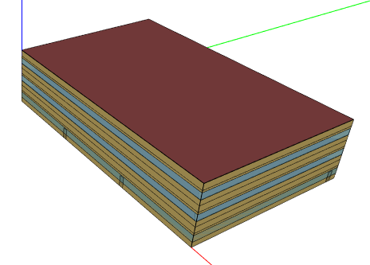
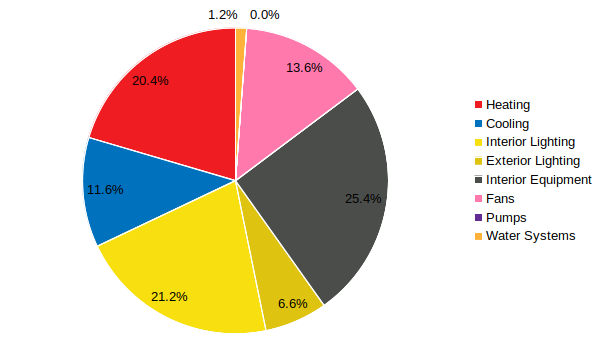
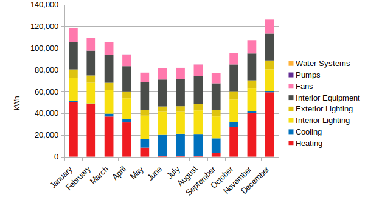
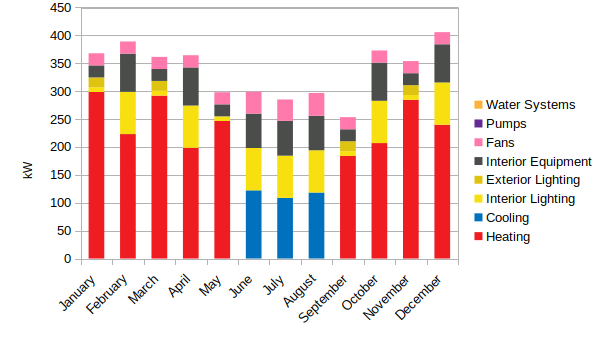
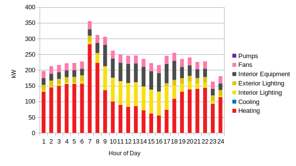
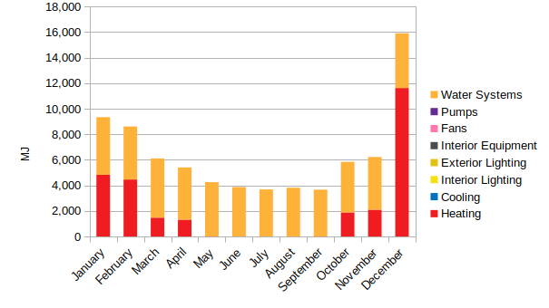
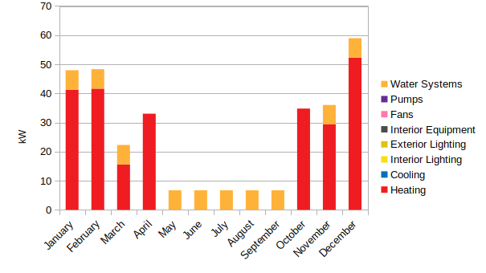
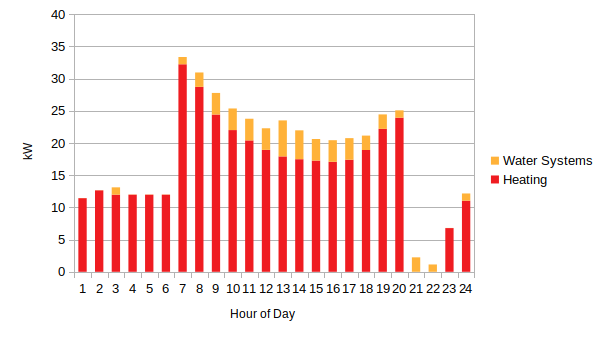
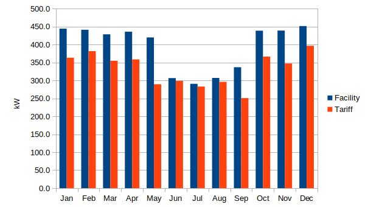

# Title

# Table of Contents

# 1. Introduction

In the United States, the electricity grid continues to experience rapid changes both on the supply and demand sides. On the supply side, its generation fuel mix is shifting away from coal and nuclear sources towards natural gas and renewable energy sources. At the same time, grid operators must balance an increasing supply of non-dispatchable and intermittently available renewable sources such as wind and solar, which are projected to be the fastest growing electricity resource through 2050 (EIA, 2020). On the demand side, an increasing share of demand is now met by distributed energy resources (DER) such as solar photovoltaics (PV), which are also supplying energy to the grid through net metering. These changes are driven mostly by retiring less efficient fossil fuel-based generation sources, low natural gas prices, policies supporting renewable energy, and continued decline in renewable energy costs. At the same time, concerns about climate change have also begun to shift both supply-side and demand-side fuel sources away from fossil fuel-based sources to renewable energy sources. Utilities are committing to 100% renewable energy goals as municipalities adopt electrification policies for buildings in an effort to reduce carbon emissions.

Fundamentally, grid operators must balance electricity supply with demand. In order for the operators to have enough generation capacity in reserve to meet periods of high peak demands, utilities need to build new generation capacity requiring costly and long-term investments. To defer the construction of new generation capacity, utilities often implement programs that reduce, shed, or shift load through demand-side management (DSM), energy efficiency, or demand response (DR) programs. Buildings, which collectively consumed 63% of delivered electricity in the U.S. in 2019 (15% residential, 12% commercial, 35% industrial, EIA 2020), have the potential to offer grid services through implementation of DSM strategies that enhance electrical load flexibility. Grid-interactive efficient buildings (GEBs) that use existing and new technologies to provide demand flexibility have recently emerged as a way to balance the grid's supply and demand and a source of value through avoided electricity system costs (DOE, 2019a).

This report...

# 2. Methodology

The analysis used a reference building energy model from the U.S. Department of Energy Commercial Reference Building Models (Deru et. al., 2011) as the starting point for evaluating the technologies, henceforth referred to as the baseline. The reference building models are collectively representative of over 60% of the commercial building stock in the United States and are meant to represent generic existing and new buildings rather than a specific individual building. The Medium Office model was chosen because it is most representative of the commercial building stock in the United States based on area (EIA, 2012). 

## Baseline Model Inputs

The baseline model was created with OpenStudio (NREL, 2011) using the Create Prototype Building measure. Measures are formal computer scripts written in the Ruby programming language that can interact with an OpenStudio model directly, change the EnergyPlus model during runtime, or produce reports after simulation (Roth et. al, 2016). Several changes to the baseline model were required to allow the application of specific technologies, which are described in the Measures secion. In total, the changes decreased the energy use intensity (EUI) by 0.9% and increased the peak electric demand by 10.2% (unadjusted facility) and 4.8% (adjusted utility).

__Figure x. Model Geometry (green axis is north)__

__Table x. General Inputs__

| Input | Description |
| :- | :- |
| Occupancy | 0.053820 people/m2 |
| Schedule | Mon-Fri, 0600-2200 Sat, 0600-1700 |
| Utility Rates | Xcel Energy Electricity: Secondary General Natural Gas: Large CG |

__Table x. Geometry Inputs__

| Input | Description |
| :- | :- |
| Total Floor Area (m2) | 4982 |
| Floor to Ceiling Height (m) | 2.7 |
| Floor to Floor Height (m) | 4 |
| Building Shape | Rectangle |
| Aspect Ratio | 1.5 |
| Number of Floors | 3 |
| Exterior Shading | None |
| Azimuth | 0 |

__Table x. Architectural Inputs__

| Input | Description |
| :- | :- |
| Roofs | Insulation Entirely Above Deck U-0.501 |
| Walls, above grade | Steel-Framed U-0.302 |
| Slab-on-Grade Floors | Mass (4” concrete) U-3.402 |
| Windows | Layered Glazing U-2.371, SHGC-0.180, VT-0.137 |
| Doors | Swinging, Insulated Metal U-35.433 |
| Window-to-Wall Ratio | 33% all facades  |
| Infiltration (ACH) | 0.75 |

__Table x. Electrical Inputs__

| Input | Description |
| :- | :- |
| Interior Lighting Power | 16.9 W/m2 |
| Interior Lighting Controls |  |
| Exterior Lighting Power | 17809 W |
| Exterior Lighting Controls | Astronomical time switch |
| Equipment Power | 10.76 W/m2 |
| Conveyance | Elevator: 14610 W |

__Table x. Mechanical Inputs__

| Input | Description |
| :- | :- |
| Thermal Zoning | core zone with four perimeter zones on each floor |
| Setpoints | Cooling: 24C/26.7C Heating: 24C/15.6C Humidity: 45%|
| System Type | (3) MZ-VAV |
| Heating Type | Gas furnace and electric reheat |
| Cooling Type | Single Speed PACU |
| Fan Control | Variable |

__Table x. Plumbing Inputs__

| Input | Description |
| :- | :- |
| SWH Type | gas water heater |
| Fuel | gas |
| Thermal Efficiency | 0.78 |
| Temperature Setpoint | 60C |
| Water Consumption | 0.00006-0.00036 m3/min |

## Baseline Model Outputs

__Figure x. Annual Energy Use Percent__

__Figure x. Annual Energy Use Intensity__

__Figure x. Monthly Electricity Energy__

__Figure x. Monthly Electricity Demand__

__Figure x. Hourly Electricity Demand on Peak Day (Dec 22)__

__Figure x. Monthly Natural Gas Energy__

__Figure x. Monthly Natural Gas Demand__

__Figure x. Hourly Natural Gas Demand on Peak Day (Dec 20)__

__Figure x. Monthly Electricity Peak vs. Utility Demand__

## Measures

_TODO describe measures and results of individual measures in the context of GEBs_

## Optimization Process

_TODO since PAT does not have sequential search, use genetic algorithm(GA) or particle swarm optimization (PSO) techniques to perform optimization analyses_

# 3. Results

# 4. Discussion

# 5. Conclusions
