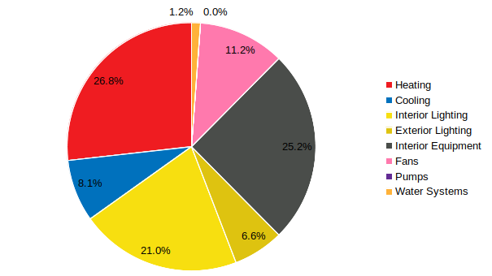
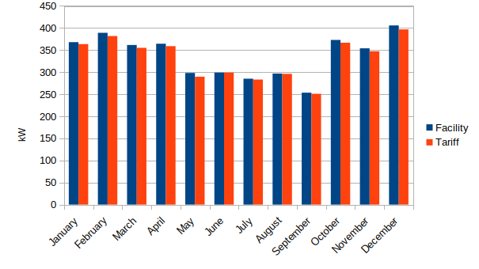
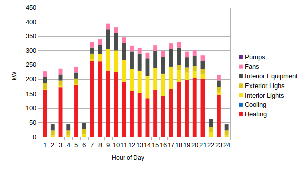
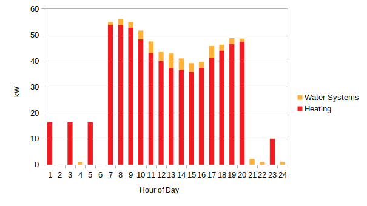

# Title

# Table of Contents

# 1. Introduction

# 2. Materials and Methods

Describe DOE ref bldg and include GEB characteristics (efficiency, load, etc.).

__Figure x. Model Geometry (green axis is north)__

__Table x. Architectural Systems__

* _tables summarizing model systems (architectural, electrical, mechanical, plumbing)_

## Energy Use

__Figure x. Annual Energy End Uses__

__Figure x. Monthly Electricity Energy__

__Figure x. Monthly Electricity Demand__

__Figure x. Monthly Electricity Peak vs. Utility Demand__

__Figure x. Peak Day Hourly Electricity Demand (Dec 21)__

__Figure x. Monthly Natural Gas Energy__

__Figure x. Monthly Natural Gas Demand__

__Figure x. Peak Day Hourly Natural Gas Demand (Dec 22)__

# 3. Results

# 4. Discussion

# 5. Conclusions
