# Title

# Table of Contents


# 1. Introduction

In the United States, the electricity grid continues to experience rapid changes both on the supply and demand sides. On the supply side, its generation fuel mix is shifting away from coal and nuclear sources towards natural gas and renewable energy sources. At the same time, grid operators must balance an increasing supply of non-dispatchable and intermittently available renewable sources such as wind and solar, which are projected to be the fastest growing electricity resource through 2050 (EIA, 2020). On the demand side, an increasing share of demand is now met by distributed energy resources (DER) such as solar photovoltaics (PV), which are also supplying energy to the grid through net metering. These changes are driven mostly by retiring less efficient fossil fuel-based generation sources, low natural gas prices, policies supporting renewable energy, and continued decline in renewable energy costs. At the same time, concerns about climate change have also begun to shift both supply-side and demand-side fuel sources away from fossil fuel-based sources to renewable energy sources. Utilities are committing to 100% renewable energy goals as municipalities adopt electrification policies for buildings in an effort to reduce carbon emissions.

Fundamentally, grid operators must balance electricity supply with demand. In order for the operators to have enough generation capacity in reserve to meet periods of high peak demands, utilities need to build new generation capacity requiring costly and long-term investments. To defer the construction of new generation capacity, utilities often implement programs that reduce, shed, or shift load through demand-side management (DSM), energy efficiency, or demand response (DR) programs. Buildings, which collectively consumed 63% of delivered electricity in the U.S. in 2019 (15% residential, 12% commercial, 35% industrial, EIA 2020), have the potential to offer grid services through implementation of DSM strategies that enhance electrical load flexibility. Grid-interactive efficient buildings (GEBs) that use existing and new technologies to provide demand flexibility have recently emerged as a way to balance the grid's supply and demand and a source of value through avoided electricity system costs (DOE, 2019a).

This report...

# 2. Methodology

The analysis used a reference building energy model from the U.S. Department of Energy Commercial Reference Building Models (Deru et. al., 2011) as the starting point for evaluating the technologies, henceforth referred to as the baseline. The reference building models are collectively representative of over 60% of the commercial building stock in the United States and are meant to represent generic existing and new buildings rather than a specific individual building. The Medium Office model was chosen because it is most representative of the commercial building stock in the United States based on area (EIA, 2012). 

## Baseline Model Inputs

The baseline model was created with OpenStudio (NREL, 2011) using the Create Prototype Building measure. Measures are formal computer scripts written in the Ruby programming language that can interact with an OpenStudio model directly, change the EnergyPlus model during runtime, or produce reports after simulation (Roth et. al, 2016). Several changes to the baseline model were required to allow the application of specific technologies, which are described in the Measures secion. In total, the changes decreased the energy use intensity (EUI) by 0.9% and increased the peak electric demand by 10.2% (unadjusted facility) and 4.8% (adjusted utility).


__Figure x. Model Geometry (green axis is north)__

__Table x. General Inputs__

| Input | Description |
| :- | :- |
| Occupancy | 0.053820 people/m2 |
| Schedule | Mon-Fri, 0600-2200 Sat, 0600-1700 |
| Utility Rates | Xcel Energy Electricity: Secondary General Natural Gas: Large CG |

__Table x. Geometry Inputs__

| Input | Description |
| :- | :- |
| Total Floor Area (m2) | 4982 |
| Floor to Ceiling Height (m) | 2.7 |
| Floor to Floor Height (m) | 4 |
| Building Shape | Rectangle |
| Aspect Ratio | 1.5 |
| Number of Floors | 3 |
| Exterior Shading | None |
| Azimuth | 0 |

__Table x. Architectural Inputs__

| Input | Description |
| :- | :- |
| Roofs | Insulation Entirely Above Deck U-0.501 |
| Walls, above grade | Steel-Framed U-0.302 |
| Slab-on-Grade Floors | Mass (4” concrete) U-3.402 |
| Windows | Layered Glazing U-2.371, SHGC-0.180, VT-0.137 |
| Doors | Swinging, Insulated Metal U-35.433 |
| Window-to-Wall Ratio | 33% all facades  |
| Infiltration (ACH) | 0.75 |

__Table x. Electrical Inputs__

| Input | Description |
| :- | :- |
| Interior Lighting Power | 16.9 W/m2 |
| Interior Lighting Controls |  |
| Exterior Lighting Power | 17809 W |
| Exterior Lighting Controls | Astronomical time switch |
| Equipment Power | 10.76 W/m2 |
| Conveyance | Elevator: 14610 W |

__Table x. Mechanical Inputs__

| Input | Description |
| :- | :- |
| Thermal Zoning | core zone with four perimeter zones on each floor |
| Setpoints | Cooling: 24C/26.7C Heating: 24C/15.6C Humidity: 45%|
| System Type | (3) MZ-VAV |
| Heating Type | Gas furnace and electric reheat |
| Cooling Type | Single Speed PACU |
| Fan Control | Variable |

__Table x. Plumbing Inputs__

| Input | Description |
| :- | :- |
| SWH Type | gas water heater |
| Fuel | gas |
| Thermal Efficiency | 0.78 |
| Temperature Setpoint | 60C |
| Water Consumption | 0.00006-0.00036 m3/min |

## Baseline Model Outputs


__Figure x. Annual Energy Use Percent__


__Figure x. Annual Energy Use Intensity__


__Figure x. Monthly Electricity Energy__


__Figure x. Monthly Electricity Demand__


__Figure x. Hourly Electricity Demand on Peak Day (Dec 22)__


__Figure x. Monthly Natural Gas Energy__


__Figure x. Monthly Natural Gas Demand__


__Figure x. Hourly Natural Gas Demand on Peak Day (Dec 20)__


__Figure x. Monthly Electricity Peak vs. Utility Demand__

## Measures

This section describes the nine measures used to apply each technology to the baseline model and the individual model results compared to the baseline. The measures are coded according to the following table.

Code | Category | Description
:- | :- | :-
 A1 | Architectural | Thermal Storage
 A2 |  | Dynamic Glazing
 A3 |  | Automated Attachments
 E1 | Electrical | Continuous-Operation Electronics
 M1 | Mechanical | Separate Sensible and Latent Space Conditioning
 M2 |  | Thermal Energy Storage
 P1 | Plumbing | Building-Scale CHP
 C1 | Controls | Advanced Sensors and Controls (lighting)
 C2 |  | Smart Thermostats

The annual energy cost and use results for the individual measures are shown in Figures x. and x. below.

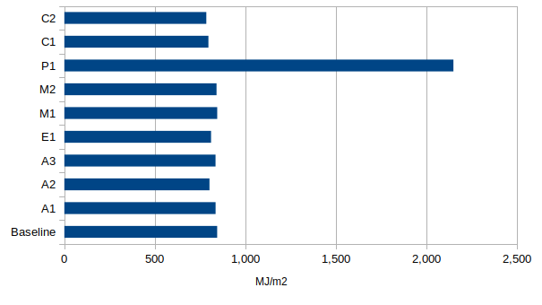

__Figure x. Individual Measure Annual Energy Use Intensity__


__Figure x. Individual Measure Annual Energy Cost__

### Thermal Storage (A1)

This measure adds the EnergyPlus object `MaterialProperty:PhaseChange` (DOE, 2020) to all interior surfaces in the model. The object's properties were taken from the EnergyPlus example file `MaterialPropertyPhaseChange.idf` (DOE, 2020) shown below.

```
	MaterialProperty:PhaseChange,
		#{construction_interior_layer_name},  !- Name
		0,                       !- Temperature Coefficient for Thermal Conductivity {W/m-K2}
		-20,                     !- Temperature 1 {C}
		0.1,                     !- Enthalpy 1 {J/kg}
		22,                      !- Temperature 2 {C}
		18260,                   !- Enthalpy 2 {J/kg}
		22.1,                    !- Temperature 3 {C}
		32000,                   !- Enthalpy 3 {J/kg}
		60,                      !- Temperature 4 {C}
		71000;                   !- Enthalpy 4 {J/kg}
```

The `MaterialProperty:PhaseChange` object describes the temperature-enthalpy relationship of the Material object referenced by the Name field. This object requires the use of EnergyPlus' conduction finite difference heat balance algorithm, rather than its default conduction transfer function (CTF) method, because the CTF requires constant material properties (e.g. specific heat), which was one of the required changes to the baseline model for this analysis. Additionally, the timestep was changed from six per hour to 12 per hour to accomodate the phase change material. The `Temperature Coefficient for Thermal Conductivity` field describes the material's thermal conductivity change per unit temperature from 20C in W/m-K2. Thermal conductivity is calculated from:

k = {k_o} + {k_1}({T_i} - 20)

where:

k\(_{o}\) is the 20C value of thermal conductivity(normal idf~ input)

k\(_{1}\) is the change in conductivity per degree temperature difference from 20C

The annual energy use intensity and energy cost savings for this measure is shown in Figures x. and x. below.

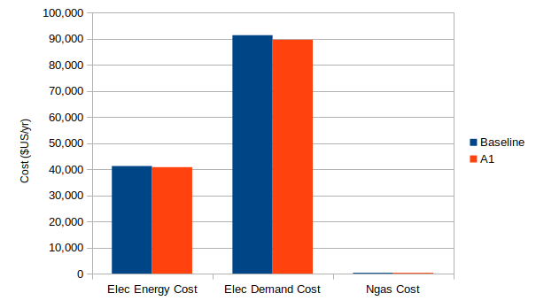

__Figure x. Measure A1 Annual Energy Cost Savings__

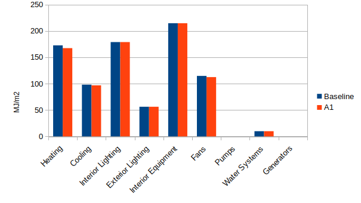

__Figure x. Measure A1 Annual Energy Use Intensity Savings by End Use__

### Dynamic Glazing (A2)

This measure adds the OpenStudio object `ShadingControl` to the model, which is translated to the EnergyPlus object `WindowShadingControl` prior to simulation as shown below.  

```
WindowShadingControl,
  Shading Control 1,                      !- Name
  Perimeter_top_ZN_1 ZN,                  !- Zone Name
  1,                                      !- Shading Control Sequence Number
  SwitchableGlazing,                      !- Shading Type
  Dbl Elec Ref Colored 6mm/6mm Air,       !- Construction with Shading Name
  OnIfHighSolarOnWindow,                  !- Shading Control Type
  ,                                       !- Schedule Name
  20,                                     !- Setpoint {W/m2, W or deg C}
  No,                                     !- Shading Control Is Scheduled
  No,                                     !- Glare Control Is Active
  ,                                       !- Shading Device Material Name
  FixedSlatAngle,                         !- Type of Slat Angle Control for Blinds
  ,                                       !- Slat Angle Schedule Name
  ,                                       !- Setpoint 2 {BasedOnField A5}
  ,                                       !- Daylighting Control Object Name
  Sequential,                             !- Multiple Surface Control Type
  Perimeter_top_ZN_1_Wall_South_Window,   !- Fenestration Surface Name 1
  Perimeter_top_ZN_3_Wall_North_Window,   !- Fenestration Surface Name 2
  Perimeter_top_ZN_4_Wall_West_Window,    !- Fenestration Surface Name 3
  Perimeter_bot_ZN_2_Wall_East_Window,    !- Fenestration Surface Name 4
  Perimeter_mid_ZN_4_Wall_West_Window,    !- Fenestration Surface Name 5
  Perimeter_mid_ZN_1_Wall_South_Window,   !- Fenestration Surface Name 6
  Perimeter_mid_ZN_2_Wall_East_Window,    !- Fenestration Surface Name 7
  Perimeter_bot_ZN_4_Wall_West_Window,    !- Fenestration Surface Name 8
  Perimeter_top_ZN_2_Wall_East_Window,    !- Fenestration Surface Name 9
  Perimeter_bot_ZN_3_Wall_North_Window,   !- Fenestration Surface Name 10
  Perimeter_mid_ZN_3_Wall_North_Window,   !- Fenestration Surface Name 11
  Perimeter_bot_ZN_1_Wall_South_Window;   !- Fenestration Surface Name 12
```

The `WindowShadingControl` object is used to reduce solar radiation into the thermal zone through a window. For this measure, the Shading Type was set to `SwitchableGlazing`, which allows modeling simple two-state electrochromic glazing by referencing a construction for the tinted state in the `Construction with Shading Type` field. Modeling electrochromic glazing required the baseline window constructions to be changed from `WindowMaterial:SimpleGlazingSystem`, which models an entire window assembly as a simple monolithic layer, to a more detailed layered construction made up of `WindowMaterial:Glazing` and `WindowMaterial:Gas` objects. In this case, both the untinted and the tinted window constructions were taken from the `WindowConstructs.idf` EnergyPlus example file, specifically the . The objects below show the window constructions before and after the changes to the baseline.

```
WindowMaterial:SimpleGlazingSystem,
  U 0.59 SHGC 0.39 Simple Glazing U-1.18 SHGC 0.39, !- Name
  6.72051227935197,                       !- U-Factor {W/m2-K}
  0.39,                                   !- Solar Heat Gain Coefficient
  0.31;                                   !- Visible Transmittance
```

```
Construction,
  Dbl Elec Ref Bleached 6mm/6mm Air,      !- Name
  ECREF-2 BLEACHED 6MM,                   !- Layer 1
  AIR 6MM,                                !- Layer 2
  CLEAR 6MM;                              !- Layer 3

! U=2.371  SHGC=0.18  TSOL=0.078  TVIS=0.137

Construction,
  Dbl Elec Ref Colored 6mm/6mm Air,       !- Name
  ECREF-2 COLORED 6MM,                    !- Layer 1
  AIR 6MM,                                !- Layer 2
  CLEAR 6MM;                  

! U=1.761  SHGC=0.641  TSOL=0.545  TVIS=0.727
```

The annual energy use intensity and energy cost savings for this measure is shown in Figures x. and x. below.

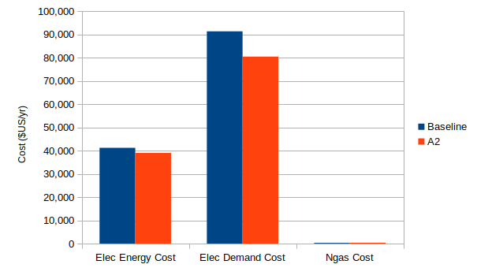

__Figure x. Measure A2 Annual Energy Cost Savings__

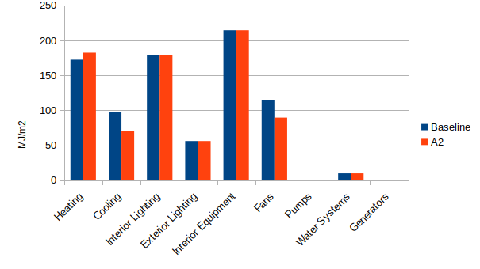

__Figure x. Measure A2 Annual Energy Use Intensity Savings by End Use__

### Automated Attachments (A3)

This measure adds the OpenStudio object `ShadingControl` to the model, which is translated to the EnergyPlus object `WindowShadingControl` prior to simulation as shown below.  

```
WindowShadingControl,
  Shading Control 1,                      !- Name
  Perimeter_top_ZN_1 ZN,                  !- Zone Name
  1,                                      !- Shading Control Sequence Number
  InteriorShade,                          !- Shading Type
  Dbl Elec Ref Bleached 6mm/6mm Air + Shade, !- Construction with Shading Name
  OnIfHighSolarOnWindow,                  !- Shading Control Type
  ,                                       !- Schedule Name
  20,                                     !- Setpoint {W/m2, W or deg C}
  No,                                     !- Shading Control Is Scheduled
  No,                                     !- Glare Control Is Active
  ,                                       !- Shading Device Material Name
  FixedSlatAngle,                         !- Type of Slat Angle Control for Blinds
  ,                                       !- Slat Angle Schedule Name
  ,                                       !- Setpoint 2 {BasedOnField A5}
  ,                                       !- Daylighting Control Object Name
  Sequential,                             !- Multiple Surface Control Type
  Perimeter_top_ZN_1_Wall_South_Window,   !- Fenestration Surface Name 1
  Perimeter_top_ZN_3_Wall_North_Window,   !- Fenestration Surface Name 2
  Perimeter_top_ZN_4_Wall_West_Window,    !- Fenestration Surface Name 3
  Perimeter_bot_ZN_2_Wall_East_Window,    !- Fenestration Surface Name 4
  Perimeter_mid_ZN_4_Wall_West_Window,    !- Fenestration Surface Name 5
  Perimeter_mid_ZN_1_Wall_South_Window,   !- Fenestration Surface Name 6
  Perimeter_mid_ZN_2_Wall_East_Window,    !- Fenestration Surface Name 7
  Perimeter_bot_ZN_4_Wall_West_Window,    !- Fenestration Surface Name 8
  Perimeter_top_ZN_2_Wall_East_Window,    !- Fenestration Surface Name 9
  Perimeter_bot_ZN_3_Wall_North_Window,   !- Fenestration Surface Name 10
  Perimeter_mid_ZN_3_Wall_North_Window,   !- Fenestration Surface Name 11
  Perimeter_bot_ZN_1_Wall_South_Window;   !- Fenestration Surface Name 12
```

For this measure, the Shading Type was set to `InteriorShade`, which allows modeling a diffusing shade located on the inside of the window by referencing a construction with a `WindowMaterial:Shade` objecct in the `Construction with Shading Type` field. Like the A2, this measure required replacing the baseline's window construction with a detailed layered construction. Additionally, a construction with the shade was added to the model so that it was available to the measure (but unused in the baseline) as shown in the objects below. The `WindowMaterial:Shade` object was taken from the `WindowShadeMaterials.idf` EnergyPlus data set.

```
Construction,
  Dbl Elec Ref Bleached 6mm/6mm Air + Shade, !- Name
  ECREF-2 BLEACHED 6MM,                   !- Layer 1
  AIR 6MM,                                !- Layer 2
  CLEAR 6MM,                              !- Layer 3
  MEDIUM REFLECT - MEDIUM TRANS SHADE;    !- Layer 4

WindowMaterial:Shade,
  MEDIUM REFLECT - MEDIUM TRANS SHADE,    !- Name
  0.4,                                    !- Solar Transmittance {dimensionless}
  0.5,                                    !- Solar Reflectance {dimensionless}
  0.4,                                    !- Visible Transmittance {dimensionless}
  0.5,                                    !- Visible Reflectance {dimensionless}
  0.9,                                    !- Infrared Hemispherical Emissivity {dimensionless}
  0,                                      !- Infrared Transmittance {dimensionless}
  0.005,                                  !- Thickness {m}
  0.1,                                    !- Conductivity {W/m-K}
  0.05,                                   !- Shade to Glass Distance {m}
  0.5,                                    !- Top Opening Multiplier
  0.5,                                    !- Bottom Opening Multiplier
  0.5,                                    !- Left-Side Opening Multiplier
  0.5,                                    !- Right-Side Opening Multiplier
  0;                                      !- Airflow Permeability {dimensionless}
```

The annual energy use intensity and energy cost savings for this measure is shown in Figures x. and x. below.

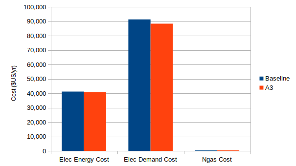

__Figure x. Measure A3 Annual Energy Cost Savings__

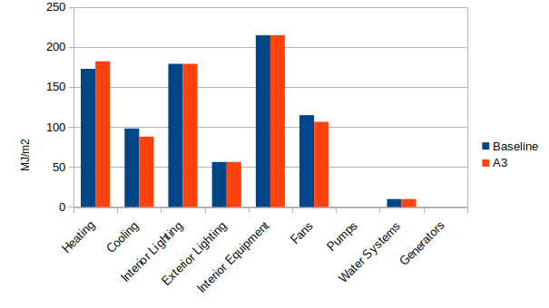

__Figure x. Measure A3 Annual Energy Use Intensity Savings by End Use__

### Continuous-Operation Electronics (E1)

This measure adds the EnergyPlus object `DemandManager:ElectricEquipment` to the model. The object's properties come from the EnergyPlus example file `5ZoneAirCooledDemandLimiting.idf` shown below.

```
DemandManager:ElectricEquipment,
  Demand Manager Electric Equipment,      !- Name
  ,                                       !- Availability Schedule Name
  Fixed,                                  !- Limit Control
  60,                                     !- Minimum Limit Duration {minutes}
  0.5,                                    !- Maximum Limit Fraction
  ,                                       !- Limit Step Change
  All,                                    !- Selection Control
  ,                                       !- Rotation Duration {minutes}
  2 Elevator Lift Motors,                 !- Electric Equipment Name 1
  Office WholeBuilding - Md Office Elec Equip; !- Electric Equipment Name 2

DemandManagerAssignmentList,
  Demand Manager Assignment List,         !- Name
  Electricity:Facility,                   !- Meter Name
  ,                                       !- Demand Limit Schedule Name
  1,                                      !- Demand Limit Safety Fraction
  ,                                       !- Billing Period Schedule Name
  ,                                       !- Peak Period Schedule Name
  15,                                     !- Demand Window Length {minutes}
  Sequential,                             !- Demand Manager Priority
  DemandManager:ElectricEquipment,        !- DemandManager Object Type 1
  Demand Manager Electric Equipment;      !- DemandManager Name 1
```

The `DemandManager:ElectricEquipment` object in EnergyPlus allows modeling common demand side management strategies to reduce power to electric equipment. The `Limit Control` field specifies whether demand limiting is on (Fixed) or off. The `DemandManager module in EnergyPlus determines whether demand limiting is required during a timestep and if so, the power to the referenced Electric Equipment is reduced by the `Maximum Limit Fraction` field. The `DemandManager:AssignmentList` object controls one or more DemandManager objects by allowing the Demand Window Length (in minumtes) and Demand Manager Priority (either Sequential or All) to be specified.

The annual energy use intensity and energy cost savings for this measure is shown in Figures x. and x. below.


__Figure x. Measure E1 Annual Energy Cost Savings__

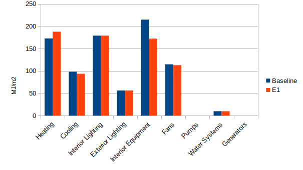

__Figure x. Measure E1 Annual Energy Use Intensity Savings by End Use__

### Separate Sensible and Latent Space Conditioning (M1)

This measure adds the EnergyPlus object [Dehumidifier:Desiccant:System](https://bigladdersoftware.com/epx/docs/9-4/input-output-reference/group-humidifiers-and-dehumidifiers.html#dehumidifierdesiccantsystem) downstream of the cooling coil on the supply air stream of all air loops in the model. The object's properties come from the the EnergyPlus example file `DesiccantDehumidifierWithCompanionCoil.idf` shown below.

```
! Modeling Munters HCU (humidity control unit)
Dehumidifier:Desiccant:System,
	Desiccant,             !- Name
	FanAvailSched,           !- Availability Schedule Name
	HeatExchanger:Desiccant:BalancedFlow,  !- Desiccant Heat Exchanger Object Type
	Desiccant Heat Exchanger 1,  !- Desiccant Heat Exchanger Name
	HX Process Outlet Node,  !- Sensor Node Name
	Fan:SystemModel,         !- Regeneration Air Fan Object Type
	Desiccant Regen Fan,     !- Regeneration Air Fan Name
	DrawThrough,             !- Regeneration Air Fan Placement
	Coil:Heating:Fuel,       !- Regeneration Air Heater Object Type
	Desiccant Regen Coil,    !- Regeneration Air Heater Name
	46.111111,               !- Regeneration Inlet Air Setpoint Temperature {C}
	Coil:Cooling:DX:SingleSpeed,  !- Companion Cooling Coil Object Type
	Desiccant DXSystem Cooling Coil,  !- Companion Cooling Coil Name
	Yes,                     !- Companion Cooling Coil Upstream of Dehumidifier Process Inlet
	Yes,                     !- Companion Coil Regeneration Air Heating
	,                    !- Exhaust Fan Maximum Flow Rate {m3/s} 1.05
	50,                      !- Exhaust Fan Maximum Power {W}
	EXHAUSTFANPLF;           !- Exhaust Fan Power Curve Name
```

The annual energy use intensity and energy cost savings for this measure is shown in Figures x. and x. below.


__Figure x. Measure M1 Annual Energy Cost Savings__

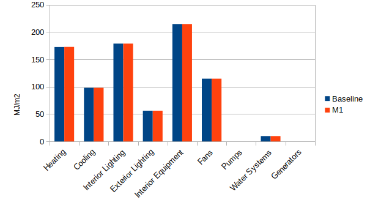

__Figure x. Measure M1 Annual Energy Use Intensity Savings by End Use__

### Thermal Energy Storage (M2)

This [measure](https://github.com/NREL/openstudio-load-flexibility-measures-gem/releases/tag/v0.1.3) replaces CoilSystem:Cooling:DX objects in the model with the EnergyPlus object [Coil:Cooling:DX:SingleSpeed:ThermalStorage](https://bigladdersoftware.com/epx/docs/9-4/input-output-reference/group-heating-and-cooling-coils.html#coilcoolingdxsinglespeedthermalstorage). 

The annual energy use intensity and energy cost savings for this measure is shown in Figures x. and x. below.


__Figure x. Measure M2 Annual Energy Cost Savings__

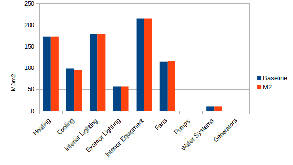

__Figure x. Measure M2 Annual Energy Use Intensity Savings by End Use__

### Building-Scale CHP (P1)

This measure adds the OpenStudio object [GeneratorMicroTurbineHeatRecovery](https://bigladdersoftware.com/epx/docs/9-4/input-output-reference/group-electric-load-center-generator.html#generatormicroturbine) to the model. The object's properties come from the EnergyPlus example file `HeatRecoveryPlantLoopAuto.idf`, which is based on the Capstone C65, and is located on the supply side of a plant loop with a water heater object. The object generates electric energy for the building and waste thermal energy is used for service hot water. The measure's code and topology is based on https://github.com/NREL/OpenStudio-resources/blob/develop/model/simulationtests/generator_microturbine.rb. The topology differs from the example file because OpenStudio does not allow WaterHeater objects on the same side of two different plant loops.

The annual energy use intensity and energy cost savings for this measure is shown in Figures x. and x. below.

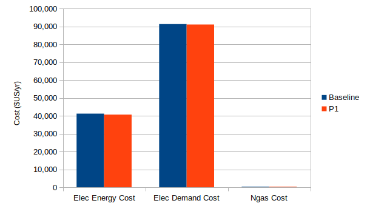

__Figure x. Measure P1 Annual Energy Cost Savings__

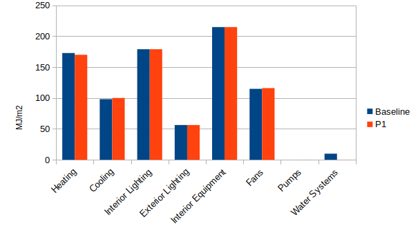

__Figure x. Measure P1 Annual Energy Use Intensity Savings by End Use__

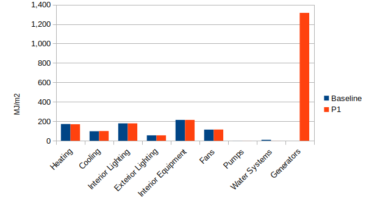

__Figure x. Measure P1 Annual Energy Use Intensity Savings by End Use__

### Advanced Sensors and Controls (lighting) (C1)

This measure adds the EnergyPlus object [DemandManager:Lights](https://bigladdersoftware.com/epx/docs/9-4/input-output-reference/group-demand-limiting-controls.html#demandmanagerlights) to the model. The object's properties come from the EnergyPlus example file `5ZoneAirCooledDemandLimiting.idf` shown below.

```
DemandManager:Lights,
	Lights Manager,          !- Name
	,                        !- Availability Schedule Name
	FIXED,                   !- Limit Control
	60,                      !- Minimum Limit Duration {minutes}
	0.5,                     !- Maximum Limit Fraction
	,                        !- Limit Step Change
	ALL,                     !- Selection Control
	,                        !- Rotation Duration {minutes}
	AllZones with Lights;    !- Lights 1 Name    
```

The annual energy use intensity and energy cost savings for this measure is shown in Figures x. and x. below.

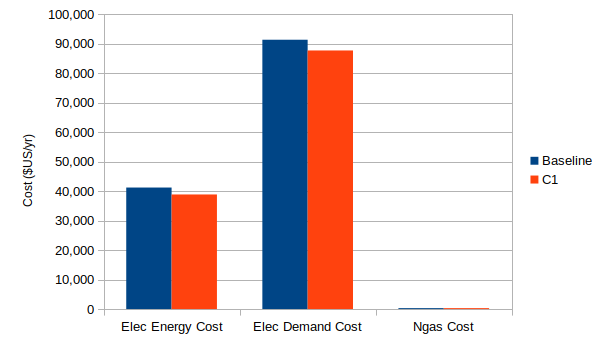

__Figure x. Measure C1 Annual Energy Cost Savings__

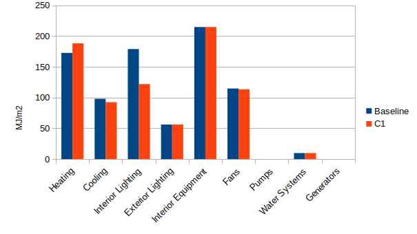

__Figure x. Measure C1 Annual Energy Use Intensity Savings by End Use__

### Smart Thermostats (C2)

This measure adds the EnergyPlus object [DemandManager:Thermostats](https://bigladdersoftware.com/epx/docs/9-4/input-output-reference/group-demand-limiting-controls.html#demandmanagerthermostats) to the model. The object's properties come from the EnergyPlus example file `5ZoneAirCooledDemandLimiting.idf` shown below.

```
DemandManager:Thermostats,
  Thermostats Manager,     !- Name
  ,                        !- Availability Schedule Name
  FIXED,                   !- Reset Control
  60,                      !- Minimum Reset Duration {minutes}
  19,                      !- Maximum Heating Setpoint Reset {C}
  26,                      !- Maximum Cooling Setpoint Reset {C}
  ,                        !- Reset Step Change
  ALL,                     !- Selection Control
  ,                        !- Rotation Duration {minutes}
  AllControlledZones Thermostat;  !- Thermostat 1 Name
```

The annual energy use intensity and energy cost savings for this measure is shown in Figures x. and x. below.

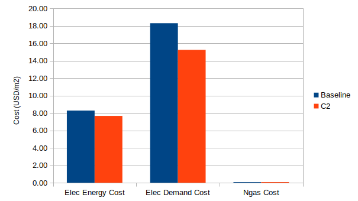

__Figure x. Measure C2 Annual Energy Cost Savings__

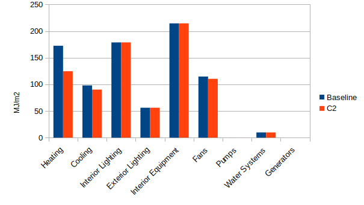

__Figure x. Measure C2 Annual Energy Use Intensity Savings by End Use__

## Optimization Process

_TODO since PAT does not have sequential search, use genetic algorithm(GA) or particle swarm optimization (PSO) techniques to perform optimization analyses_

# 3. Results


# 4. Discussion


# 5. Conclusions
