# Optimization of Grid-interactive Efficiency Building Technologies for a Medium Office Reference Model <!-- omit in toc --> 

# Table of Contents <!-- omit in toc --> 

- [1. Introduction](#1-introduction)
- [2. Methodology](#2-methodology)
  - [2.1 Baseline Model Inputs](#21-baseline-model-inputs)
  - [2.2 Baseline Model Outputs](#22-baseline-model-outputs)
  - [2.3 Measures](#23-measures)
    - [2.3.1 Thermal Storage (A1)](#231-thermal-storage-a1)
    - [2.3.2 Dynamic Glazing (A2)](#232-dynamic-glazing-a2)
    - [2.3.3 Automated Attachments (A3)](#233-automated-attachments-a3)
    - [2.3.4 Continuous-Operation Electronics (E1)](#234-continuous-operation-electronics-e1)
    - [2.3.5 Separate Sensible and Latent Space Conditioning (M1)](#235-separate-sensible-and-latent-space-conditioning-m1)
    - [2.3.6 Thermal Energy Storage (M2)](#236-thermal-energy-storage-m2)
    - [2.3.7 Building-Scale CHP (P1)](#237-building-scale-chp-p1)
    - [2.3.8 Advanced Sensors and Controls (lighting) (C1)](#238-advanced-sensors-and-controls-lighting-c1)
    - [2.3.9 Smart Thermostats (C2)](#239-smart-thermostats-c2)
  - [2.4 Optimization Process](#24-optimization-process)
- [3. Results](#3-results)
  - [3.1 Thermal Storage (A1)](#31-thermal-storage-a1)
  - [3.2 Dynamic Glazing (A2)](#32-dynamic-glazing-a2)
  - [3.3 Automated Attachments (A3)](#33-automated-attachments-a3)
  - [3.4 Continuous-Operation Electronics (E1)](#34-continuous-operation-electronics-e1)
  - [3.5 Separate Sensible and Latent Space Conditioning (M1)](#35-separate-sensible-and-latent-space-conditioning-m1)
  - [3.6 Thermal Energy Storage (M2)](#36-thermal-energy-storage-m2)
  - [3.7 Building-Scale CHP (P1)](#37-building-scale-chp-p1)
  - [3.8 Advanced Sensors and Controls (lighting) (C1)](#38-advanced-sensors-and-controls-lighting-c1)
  - [3.9 Smart Thermostats (C2)](#39-smart-thermostats-c2)
- [5. Conclusions](#5-conclusions)

# 1. Introduction

In the United States, the electricity grid continues to experience rapid changes both on the supply and demand sides. On the supply side, its generation fuel mix is shifting away from coal and nuclear sources towards natural gas and renewable energy sources. At the same time, grid operators must balance an increasing supply of non-dispatchable and intermittently available renewable sources such as wind and solar, which are projected to be the fastest growing electricity resource through 2050 (EIA, 2020). On the demand side, an increasing share of demand is now met by distributed energy resources (DER) such as solar photovoltaics (PV), which are also supplying energy to the grid through net metering. These changes are driven mostly by retiring less efficient fossil fuel-based generation sources, low natural gas prices, policies supporting renewable energy, and continued decline in renewable energy costs. At the same time, concerns about climate change have also begun to shift both supply-side and demand-side fuel sources away from fossil fuel-based sources to renewable energy sources. Utilities are committing to 100% renewable energy goals as municipalities adopt electrification policies for buildings in an effort to reduce carbon emissions.

Fundamentally, grid operators must balance electricity supply with demand. In order for the operators to have enough generation capacity in reserve to meet periods of high peak demands, utilities need to build new generation capacity requiring costly and long-term investments. To defer the construction of new generation capacity, utilities often implement programs that reduce, shed, or shift load through demand-side management (DSM), energy efficiency, or demand response (DR) programs. Buildings, which collectively consumed 63% of delivered electricity in the U.S. in 2019 (15% residential, 12% commercial, 35% industrial, EIA 2020), have the potential to offer grid services through implementation of DSM strategies that enhance electrical load flexibility. Grid-interactive efficient buildings (GEBs) that use existing and new technologies to provide demand flexibility have recently emerged as a way to balance the grid's supply and demand and a source of value through avoided electricity system costs (DOE, 2019a).

This report builds upon previous work that reviewed and categorized GEB technologies (Steen et. al., 2020) by quantitatively evaluating these technologies using building performance simulation. The following sections describe the methodology, results, and conclusions of the analysis. 

# 2. Methodology

The analysis used a reference building energy model from the U.S. Department of Energy Commercial Reference Building Models (Deru et. al., 2011) as the starting point for evaluating the technologies, henceforth referred to as the baseline. The reference building models are EnergyPlus models (Crawley et. al., 2001) that are collectively representative of over 60% of the commercial building stock in the United States and are meant to represent generic existing and new buildings rather than a specific individual building. The Medium Office model was chosen because it is most representative of the commercial building stock in the United States based on area (EIA, 2012). 

## 2.1 Baseline Model Inputs

The baseline model was created with OpenStudio (Guglielmetti et. al., 2011) using the Create Prototype Building measure. Measures are formal computer scripts written in the Ruby programming language that can interact with an OpenStudio model directly (an OpenStudio Measure), change the EnergyPlus model prior to simulation (an EnergyPlus Measure), or produce reports after simulation with Reporting Measures (Roth et. al, 2016). Several changes to the baseline model were required to allow the application of specific technologies, which are described in the Measures section. In total, the changes decreased the energy use intensity (EUI) by 0.9% and increased the peak electric demand by 10.2% (unadjusted facility) and 4.8% (adjusted utility).


__Figure x. Model Geometry (green axis is north)__

__Table x. General Inputs__

| Input | Description |
| :- | :- |
| Occupancy | 0.053820 people/m2 |
| Schedule | Mon-Fri, 0600-2200 Sat, 0600-1700 |
| Utility Rates | Xcel Energy Electricity: Secondary General Natural Gas: Large CG |

__Table x. Geometry Inputs__

| Input | Description |
| :- | :- |
| Total Floor Area (m2) | 4982 |
| Floor to Ceiling Height (m) | 2.7 |
| Floor to Floor Height (m) | 4 |
| Building Shape | Rectangle |
| Aspect Ratio | 1.5 |
| Number of Floors | 3 |
| Exterior Shading | None |
| Azimuth | 0 |

__Table x. Architectural Inputs__

| Input | Description |
| :- | :- |
| Roofs | Insulation Entirely Above Deck U-0.501 |
| Walls, above grade | Steel-Framed U-0.302 |
| Slab-on-Grade Floors | Mass (4” concrete) U-3.402 |
| Windows | Layered Glazing U-2.371, SHGC-0.180, VT-0.137 |
| Doors | Swinging, Insulated Metal U-35.433 |
| Window-to-Wall Ratio | 33% all facades  |
| Infiltration (ACH) | 0.75 |

__Table x. Electrical Inputs__

| Input | Description |
| :- | :- |
| Interior Lighting Power | 16.9 W/m2 |
| Interior Lighting Controls |  |
| Exterior Lighting Power | 17809 W |
| Exterior Lighting Controls | Astronomical time switch |
| Equipment Power | 10.76 W/m2 |
| Conveyance | Elevator: 14610 W |

__Table x. Mechanical Inputs__

| Input | Description |
| :- | :- |
| Thermal Zoning | core zone with four perimeter zones on each floor |
| Setpoints | Cooling: 24C/26.7C Heating: 24C/15.6C Humidity: 45%|
| System Type | (3) MZ-VAV |
| Heating Type | Gas furnace and electric reheat |
| Cooling Type | Single Speed PACU |
| Fan Control | Variable |

__Table x. Plumbing Inputs__

| Input | Description |
| :- | :- |
| SWH Type | gas water heater |
| Fuel | gas |
| Thermal Efficiency | 0.78 |
| Temperature Setpoint | 60C |
| Water Consumption | 0.00006-0.00036 m3/min |

## 2.2 Baseline Model Outputs


__Figure x. Annual Energy Use Percent__


__Figure x. Annual Energy Use Intensity__


__Figure x. Monthly Electricity Energy__


__Figure x. Monthly Electricity Demand__


__Figure x. Hourly Electricity Demand on Peak Day (Feb 06)__


__Figure x. Monthly Natural Gas Energy__


__Figure x. Monthly Natural Gas Demand__


__Figure x. Hourly Natural Gas Demand on Peak Day (Dec 22)__


__Figure x. Monthly Electricity Peak vs. Utility Demand__

## 2.3 Measures

This section describes the nine measures used to apply each technology to the baseline model, which are coded according to Table x. Where a change to the baseline model was required to apply a measure, it is described in with the corresponding measure. 

__Table x. Measure Codes__

Code | Category | Description
:- | :- | :-
 A1 | Architectural | Thermal Storage
 A2 |  | Dynamic Glazing
 A3 |  | Automated Attachments
 E1 | Electrical | Continuous-Operation Electronics
 M1 | Mechanical | Separate Sensible and Latent Space Conditioning
 M2 |  | Thermal Energy Storage
 P1 | Plumbing | Building-Scale CHP
 C1 | Controls | Advanced Sensors and Controls (lighting)
 C2 |  | Smart Thermostats

### 2.3.1 Thermal Storage (A1)

This EnergyPlus measure adds phase change properties to the selected material by adding a `MaterialProperty:PhaseChange` object. This object requires the conduction finite difference heat balance algorithm rather than the default conduction transfer function algorithm, which requires constant material properties (e.g. specific heat). The object properties come from the `CondFD1ZonePurchAirAutoSizeWithPCM.idf` EnergyPlus example file as shown below. 

```
MaterialProperty:PhaseChange,
  5/8 in. Gypsum Board,                   !- Name
  0,                                      !- Temperature Coefficient for Thermal Conductivity {W/m-K2}
  -20,                                    !- Temperature 1 {C}
  0.1,                                    !- Enthalpy 1 {J/kg}
  22,                                     !- Temperature 2 {C}
  18260,                                  !- Enthalpy 2 {J/kg}
  22.1,                                   !- Temperature 3 {C}
  32000,                                  !- Enthalpy 3 {J/kg}
  60,                                     !- Temperature 4 {C}
  71000;                                  !- Enthalpy 4 {J/kg}
```

The `MaterialProperty:PhaseChange` object describes the temperature-enthalpy relationship of the Material object referenced by the Name field. The `Temperature Coefficient for Thermal Conductivity` field describes the material's thermal conductivity change per unit temperature from 20C in W/m-K2. Thermal conductivity is calculated from:

k = {k_o} + {k_1}({T_i} - 20)

where:

k\(_{o}\) is the 20C value of thermal conductivity(normal idf~ input)

k\(_{1}\) is the change in conductivity per degree temperature difference from 20C

For this analysis, the baseline heat balance algorithm was changed to conduction finite difference and the phase change material was added to the interior layer of all walls, i.e. the layer exposed to the thermal zone, because the phase change temperature occurs at 22C as shown in figure x. 


__Figure x. Measure A1 Temperature-Enthalpy Relationship__

### 2.3.2 Dynamic Glazing (A2)
 
This OpenStudio measure adds `ShadingControl` objects to the model by specifying a Construction with shading. The `ShadingControl` objects are translated to EnergyPlus `WindowShadingControl` objects prior to simulation. The Construction must be a detailed fenestration, i.e. be composed of `WindowMaterialGlazing` rather than `WindowMaterialSimpleGlazingSystem`. The object below shows an example.  

```
WindowShadingControl,
  Shading Control 1,                      !- Name
  Perimeter_top_ZN_1 ZN,                  !- Zone Name
  1,                                      !- Shading Control Sequence Number
  SwitchableGlazing,                      !- Shading Type
  Dbl Elec Ref Colored 6mm/6mm Air,       !- Construction with Shading Name
  OnIfHighSolarOnWindow,                  !- Shading Control Type
  ,                                       !- Schedule Name
  20,                                     !- Setpoint {W/m2, W or deg C}
  No,                                     !- Shading Control Is Scheduled
  No,                                     !- Glare Control Is Active
  ,                                       !- Shading Device Material Name
  FixedSlatAngle,                         !- Type of Slat Angle Control for Blinds
  ,                                       !- Slat Angle Schedule Name
  ,                                       !- Setpoint 2 {BasedOnField A5}
  ,                                       !- Daylighting Control Object Name
  Sequential,                             !- Multiple Surface Control Type
  Perimeter_top_ZN_1_Wall_South_Window,   !- Fenestration Surface Name 1
  Perimeter_top_ZN_3_Wall_North_Window,   !- Fenestration Surface Name 2
  Perimeter_top_ZN_4_Wall_West_Window,    !- Fenestration Surface Name 3
  Perimeter_bot_ZN_2_Wall_East_Window,    !- Fenestration Surface Name 4
  Perimeter_mid_ZN_4_Wall_West_Window,    !- Fenestration Surface Name 5
  Perimeter_mid_ZN_1_Wall_South_Window,   !- Fenestration Surface Name 6
  Perimeter_mid_ZN_2_Wall_East_Window,    !- Fenestration Surface Name 7
  Perimeter_bot_ZN_4_Wall_West_Window,    !- Fenestration Surface Name 8
  Perimeter_top_ZN_2_Wall_East_Window,    !- Fenestration Surface Name 9
  Perimeter_bot_ZN_3_Wall_North_Window,   !- Fenestration Surface Name 10
  Perimeter_mid_ZN_3_Wall_North_Window,   !- Fenestration Surface Name 11
  Perimeter_bot_ZN_1_Wall_South_Window;   !- Fenestration Surface Name 12
```

The `WindowShadingControl` object is used to reduce solar radiation through a window into the referenced thermal zone. For this measure, the Shading Type was set to `SwitchableGlazing`, which allows modeling simple two-state electrochromic glazing by referencing a construction for the tinted state in the `Construction with Shading Type` field. 

Modeling electrochromic glazing required the baseline window constructions to be changed from `WindowMaterial:SimpleGlazingSystem`, which models an entire window assembly as a simple monolithic layer, to a more detailed layered construction made up of `WindowMaterial:Glazing` and `WindowMaterial:Gas` objects. The untinted ("bleached") and tinted ("colored") window constructions were taken from the `WindowConstructs.idf` EnergyPlus data set file, specifically a double-glazed air-filled electrochromic construction. The objects below show the window constructions before and after the changes to the baseline.

```
WindowMaterial:SimpleGlazingSystem,
  U 0.59 SHGC 0.39 Simple Glazing U-1.18 SHGC 0.39, !- Name
  6.72051227935197,                       !- U-Factor {W/m2-K}
  0.39,                                   !- Solar Heat Gain Coefficient
  0.31;                                   !- Visible Transmittance
```

```
Construction,
  Dbl Elec Ref Bleached 6mm/6mm Air,      !- Name
  ECREF-2 BLEACHED 6MM,                   !- Layer 1
  AIR 6MM,                                !- Layer 2
  CLEAR 6MM;                              !- Layer 3

! U=2.371  SHGC=0.18  TSOL=0.078  TVIS=0.137

Construction,
  Dbl Elec Ref Colored 6mm/6mm Air,       !- Name
  ECREF-2 COLORED 6MM,                    !- Layer 1
  AIR 6MM,                                !- Layer 2
  CLEAR 6MM;                  

! U=1.761  SHGC=0.641  TSOL=0.545  TVIS=0.727
```

### 2.3.3 Automated Attachments (A3)

This measure is the same as A2, but adds shading control for an interior shade that covers the window according to the control type as shown in the example object below.

```
WindowShadingControl,
  Shading Control 1,                      !- Name
  Perimeter_top_ZN_1 ZN,                  !- Zone Name
  1,                                      !- Shading Control Sequence Number
  InteriorShade,                          !- Shading Type
  Dbl Elec Ref Bleached 6mm/6mm Air + Shade, !- Construction with Shading Name
  OnIfHighSolarOnWindow,                  !- Shading Control Type
  ,                                       !- Schedule Name
  20,                                     !- Setpoint {W/m2, W or deg C}
  No,                                     !- Shading Control Is Scheduled
  No,                                     !- Glare Control Is Active
  ,                                       !- Shading Device Material Name
  FixedSlatAngle,                         !- Type of Slat Angle Control for Blinds
  ,                                       !- Slat Angle Schedule Name
  ,                                       !- Setpoint 2 {BasedOnField A5}
  ,                                       !- Daylighting Control Object Name
  Sequential,                             !- Multiple Surface Control Type
  Perimeter_top_ZN_1_Wall_South_Window,   !- Fenestration Surface Name 1
  Perimeter_top_ZN_3_Wall_North_Window,   !- Fenestration Surface Name 2
  Perimeter_top_ZN_4_Wall_West_Window,    !- Fenestration Surface Name 3
  Perimeter_bot_ZN_2_Wall_East_Window,    !- Fenestration Surface Name 4
  Perimeter_mid_ZN_4_Wall_West_Window,    !- Fenestration Surface Name 5
  Perimeter_mid_ZN_1_Wall_South_Window,   !- Fenestration Surface Name 6
  Perimeter_mid_ZN_2_Wall_East_Window,    !- Fenestration Surface Name 7
  Perimeter_bot_ZN_4_Wall_West_Window,    !- Fenestration Surface Name 8
  Perimeter_top_ZN_2_Wall_East_Window,    !- Fenestration Surface Name 9
  Perimeter_bot_ZN_3_Wall_North_Window,   !- Fenestration Surface Name 10
  Perimeter_mid_ZN_3_Wall_North_Window,   !- Fenestration Surface Name 11
  Perimeter_bot_ZN_1_Wall_South_Window;   !- Fenestration Surface Name 12
```

In EnergyPlus, shades are modeled as perfect diffusers, i.e. all transmitted and reflected radiation is hemispherically-diffuse. Transmittance and reflectance are independent of the angle of incidence and the reflectance and emissivity properties are the same on both sides. Like A2, this measure required replacing the baseline's window construction with a detailed layered construction. Additionally, a construction with the shade was added to the model so that it was available to the measure (but unused in the baseline, see below). The `WindowMaterial:Shade` object was taken from the `WindowShadeMaterials.idf` EnergyPlus data set and represents a shade with medium reflectance and medium transmittance as shown below.

```
Construction,
  Dbl Elec Ref Bleached 6mm/6mm Air + Shade, !- Name
  ECREF-2 BLEACHED 6MM,                   !- Layer 1
  AIR 6MM,                                !- Layer 2
  CLEAR 6MM,                              !- Layer 3
  MEDIUM REFLECT - MEDIUM TRANS SHADE;    !- Layer 4

WindowMaterial:Shade,
  MEDIUM REFLECT - MEDIUM TRANS SHADE,    !- Name
  0.4,                                    !- Solar Transmittance {dimensionless}
  0.5,                                    !- Solar Reflectance {dimensionless}
  0.4,                                    !- Visible Transmittance {dimensionless}
  0.5,                                    !- Visible Reflectance {dimensionless}
  0.9,                                    !- Infrared Hemispherical Emissivity {dimensionless}
  0,                                      !- Infrared Transmittance {dimensionless}
  0.005,                                  !- Thickness {m}
  0.1,                                    !- Conductivity {W/m-K}
  0.05,                                   !- Shade to Glass Distance {m}
  0.5,                                    !- Top Opening Multiplier
  0.5,                                    !- Bottom Opening Multiplier
  0.5,                                    !- Left-Side Opening Multiplier
  0.5,                                    !- Right-Side Opening Multiplier
  0;                                      !- Airflow Permeability {dimensionless}
```

### 2.3.4 Continuous-Operation Electronics (E1)

This EnergyPlus measure adds a `DemandManager:ElectricEquipment` object to the model. The measure will also add a `DemandManagerAssignmentList` object if one is not present in the model. If one is, it will add the `DemandManager:ElectricEquipment` to the existing `DemandManagerAssignmentList`. The following objects are examples from the `5ZoneAirCooledDemandLimiting.idf` EnergyPlus example file.

```
DemandManager:ElectricEquipment,
  Demand Manager Electric Equipment,      !- Name
  ,                                       !- Availability Schedule Name
  Fixed,                                  !- Limit Control
  60,                                     !- Minimum Limit Duration {minutes}
  0.5,                                    !- Maximum Limit Fraction
  ,                                       !- Limit Step Change
  All,                                    !- Selection Control
  ,                                       !- Rotation Duration {minutes}
  2 Elevator Lift Motors,                 !- Electric Equipment Name 1
  Office WholeBuilding - Md Office Elec Equip; !- Electric Equipment Name 2

DemandManagerAssignmentList,
  Demand Manager Assignment List,         !- Name
  Electricity:Facility,                   !- Meter Name
  ,                                       !- Demand Limit Schedule Name
  1,                                      !- Demand Limit Safety Fraction
  ,                                       !- Billing Period Schedule Name
  ,                                       !- Peak Period Schedule Name
  15,                                     !- Demand Window Length {minutes}
  All,                                    !- Demand Manager Priority
  DemandManager:ElectricEquipment,        !- DemandManager Object Type 1
  Demand Manager Electric Equipment;      !- DemandManager Name 1
```

The `DemandManager:ElectricEquipment` object in EnergyPlus allows modeling common demand side management strategies to reduce power to electric equipment. The `Limit Control` field specifies whether demand limiting is on (Fixed) or off. The DemandManager module in EnergyPlus determines whether demand limiting is required during a simulation timestep and if so, the power to the referenced electric equipment is reduced up to the `Maximum Limit Fraction` field. The `Minimum Limit Duration` specifies the minimum amount of time that demand is reduced. The `DemandManager:AssignmentList` object controls one or more demand managers by specifying the `Demand Window Length` (in minutes) and coordinating the `Demand Manager Priority` with other demand managers, e.g. lights or thermostats (measures C1 and C2 respectively). Priority can be set to sequentially rotate through demand managers or simultaneously limit demand to all objects.

### 2.3.5 Separate Sensible and Latent Space Conditioning (M1)

This EnergyPlus measure adds a `Dehumidifier:Desiccant:System` on the selected air stream (outdoor air or supply air) of one or all air loops in the model. The measure works by replacing a surrogate object in the desired location in the air stream with the desiccant dehumidifier system. A setpoint manager must be present on the outlet node of the surrogate object to control humidity. If the system will be added to the supply air stream, the surrogate object must be directly downstream of a cooling coil, which will be the companion cooling coil to the desiccant system. The measure uses objects from the `DesiccantDehumidifierWithCompanionCoil.idf` EnergyPlus example file shown below.

```
! Modeling Munters HCU (humidity control unit)
Dehumidifier:Desiccant:System,
  Desiccant 1,                            !- Name
  ,                                       !- Availability Schedule Name
  HeatExchanger:Desiccant:BalancedFlow,   !- Desiccant Heat Exchanger Object Type
  Desiccant Heat Exchanger 1,             !- Desiccant Heat Exchanger Name
  Node 4,                                 !- Sensor Node Name
  Fan:SystemModel,                        !- Regeneration Air Fan Object Type
  Desiccant Regen Fan 1,                  !- Regeneration Air Fan Name
  DrawThrough,                            !- Regeneration Air Fan Placement
  Coil:Heating:Fuel,                      !- Regeneration Air Heater Object Type
  Desiccant Regen Coil 1,                 !- Regeneration Air Heater Name
  46.111111,                              !- Regeneration Inlet Air Setpoint Temperature {C}
  Coil:Cooling:DX:SingleSpeed,            !- Companion Cooling Coil Object Type
  1 Spd DX Clg Coil,                      !- Companion Cooling Coil Name
  Yes,                                    !- Companion Cooling Coil Upstream of Dehumidifier Process Inlet
  No,                                     !- Companion Coil Regeneration Air Heating
  ,                                       !- Exhaust Fan Maximum Flow Rate {m3/s}
  50,                                     !- Exhaust Fan Maximum Power {W}
  EXHAUSTFANPLF;                          !- Exhaust Fan Power Curve Name
```

This object is a parent object that references several child components, which include an air-to-air heat exchanger (HeatExchanger:Desiccant:BalancedFlow), an exhaust fan (optional), and a regeneration fan and heating coil (optional) to regenerate the desiccant. The operation of the desiccant system can be coordinated with a companion cooling coil by specifying its type and name in the appropriate fields. This measure required adding humidity controls to all zones served by the air loops and replacing the `Coil:Cooling:DX:TwoSpeed` objects with `Coil:Cooling:DX:SingleSpeed` objects in the baseline model. Humidity controls were set to 45% relative humidity. 

### 2.3.6 Thermal Energy Storage (M2)

This measure replaces the `Coil:Cooling:DX:SingleSpeed` objects on the supply air stream of one or more air loops in the model with `Coil:Cooling:DX:SingleSpeed:ThermalStorage` objects (TODO, https://github.com/NREL/openstudio-load-flexibility-measures-gem/tree/master/lib/measures/add_packaged_ice_storage) as shown in the example object below. 

```
Coil:Cooling:DX:SingleSpeed:ThermalStorage,
  UTSS Coil 0,                            !- Name
  ,                                       !- Availability Schedule Name
  EMSControlled,                          !- Operating Mode Control Method
  Simple User Sched,                      !- Operation Mode Control Schedule Name
  Ice,                                    !- Storage Type
  ,                                       !- User Defined Fluid Type
  ,                                       !- Fluid Storage Volume {m3}
  AutoSize,                               !- Ice Storage Capacity {GJ}
  9.0,                                    !- Storage Capacity Sizing Factor {hr}
  UTSS Coil 0 OA Ambient Node,            !- Storage Tank Ambient Temperature Node Name
  7.913,                                  !- Storage Tank to Ambient U-value Times Area Heat Transfer Coefficient {W/K}
  ,                                       !- Fluid Storage Tank Rating Temperature {C}
  AutoSize,                               !- Rated Evaporator Air Flow Rate {m3/s}
  5 Zone PVAV Mixed Air Node,             !- Evaporator Air Inlet Node Name
  Node 1,                                 !- Evaporator Air Outlet Node Name
  Yes,                                    !- Cooling Only Mode Available
  Autosize,                               !- Cooling Only Mode Rated Total Evaporator Cooling Capacity {W}
  0.7,                                    !- Cooling Only Mode Rated Sensible Heat Ratio
  2.9664518019338,                        !- Cooling Only Mode Rated COP {W/W}
  DOE Ref DX Clg Coil Cool-Cap-fT,        !- Cooling Only Mode Total Evaporator Cooling Capacity Function of Temperature Curve Name
  DOE Ref DX Clg Coil Cool-CAP-fFlow,     !- Cooling Only Mode Total Evaporator Cooling Capacity Function of Flow Fraction Curve Name
  DOE Ref DX Clg Coil Cool-EIR-fT,        !- Cooling Only Mode Energy Input Ratio Function of Temperature Curve Name
  DOE Ref DX Clg Coil Cool-EIR-fFlow,     !- Cooling Only Mode Energy Input Ratio Function of Flow Fraction Curve Name
  DOE Ref DX Clg Coil Cool-PLF-fPLR,      !- Cooling Only Mode Part Load Fraction Correlation Curve Name
  Cool-SHR-fT,                            !- Cooling Only Mode Sensible Heat Ratio Function of Temperature Curve Name
  Cool-SHR-fFF,                           !- Cooling Only Mode Sensible Heat Ratio Function of Flow Fraction Curve Name
  No,                                     !- Cooling And Charge Mode Available
  AutoSize,                               !- Cooling And Charge Mode Rated Total Evaporator Cooling Capacity {W}
  1.0,                                    !- Cooling And Charge Mode Capacity Sizing Factor
  AutoSize,                               !- Cooling And Charge Mode Rated Storage Charging Capacity {W}
  0.86,                                   !- Cooling And Charge Mode Storage Capacity Sizing Factor
  0.7,                                    !- Cooling And Charge Mode Rated Sensible Heat Ratio
  3.66668443E+00,                         !- Cooling And Charge Mode Cooling Rated COP {W/W}
  2.17,                                   !- Cooling And Charge Mode Charging Rated COP {W/W}
  CoolCharge-Cool-Cap-fT,                 !- Cooling And Charge Mode Total Evaporator Cooling Capacity Function of Temperature Curve Name
  ConstantCubic,                          !- Cooling And Charge Mode Total Evaporator Cooling Capacity Function of Flow Fraction Curve Name
  CoolCharge-Cool-EIR-fT,                 !- Cooling And Charge Mode Evaporator Energy Input Ratio Function of Temperature Curve Name
  ConstantCubic,                          !- Cooling And Charge Mode Evaporator Energy Input Ratio Function of Flow Fraction Curve Name
  Cool-PLF-fPLR,                          !- Cooling And Charge Mode Evaporator Part Load Fraction Correlation Curve Name
  ,                                       !- Cooling And Charge Mode Storage Charge Capacity Function of Temperature Curve Name
  ConstantCubic,                          !- Cooling And Charge Mode Storage Charge Capacity Function of Total Evaporator PLR Curve Name
  ,                                       !- Cooling And Charge Mode Storage Energy Input Ratio Function of Temperature Curve Name
  ConstantCubic,                          !- Cooling And Charge Mode Storage Energy Input Ratio Function of Flow Fraction Curve Name
  ConstantCubic,                          !- Cooling And Charge Mode Storage Energy Part Load Fraction Correlation Curve Name
  Cool-SHR-fT,                            !- Cooling And Charge Mode Sensible Heat Ratio Function of Temperature Curve Name
  Cool-SHR-fFF,                           !- Cooling And Charge Mode Sensible Heat Ratio Function of Flow Fraction Curve Name
  No,                                     !- Cooling And Discharge Mode Available
  ,                                       !- Cooling And Discharge Mode Rated Total Evaporator Cooling Capacity {W}
  ,                                       !- Cooling And Discharge Mode Evaporator Capacity Sizing Factor
  ,                                       !- Cooling And Discharge Mode Rated Storage Discharging Capacity {W}
  ,                                       !- Cooling And Discharge Mode Storage Discharge Capacity Sizing Factor
  ,                                       !- Cooling And Discharge Mode Rated Sensible Heat Ratio
  ,                                       !- Cooling And Discharge Mode Cooling Rated COP {W/W}
  ,                                       !- Cooling And Discharge Mode Discharging Rated COP {W/W}
  ,                                       !- Cooling And Discharge Mode Total Evaporator Cooling Capacity Function of Temperature Curve Name
  ,                                       !- Cooling And Discharge Mode Total Evaporator Cooling Capacity Function of Flow Fraction Curve Name
  ,                                       !- Cooling And Discharge Mode Evaporator Energy Input Ratio Function of Temperature Curve Name
  ,                                       !- Cooling And Discharge Mode Evaporator Energy Input Ratio Function of Flow Fraction Curve Name
  ,                                       !- Cooling And Discharge Mode Evaporator Part Load Fraction Correlation Curve Name
  ,                                       !- Cooling And Discharge Mode Storage Discharge Capacity Function of Temperature Curve Name
  ,                                       !- Cooling And Discharge Mode Storage Discharge Capacity Function of Flow Fraction Curve Name
  ,                                       !- Cooling And Discharge Mode Storage Discharge Capacity Function of Total Evaporator PLR Curve Name
  ,                                       !- Cooling And Discharge Mode Storage Energy Input Ratio Function of Temperature Curve Name
  ,                                       !- Cooling And Discharge Mode Storage Energy Input Ratio Function of Flow Fraction Curve Name
  ,                                       !- Cooling And Discharge Mode Storage Energy Part Load Fraction Correlation Curve Name
  ,                                       !- Cooling And Discharge Mode Sensible Heat Ratio Function of Temperature Curve Name
  ,                                       !- Cooling And Discharge Mode Sensible Heat Ratio Function of Flow Fraction Curve Name
  Yes,                                    !- Charge Only Mode Available
  AutoSize,                               !- Charge Only Mode Rated Storage Charging Capacity {W}
  0.8,                                    !- Charge Only Mode Capacity Sizing Factor
  3.09,                                   !- Charge Only Mode Charging Rated COP {W/W}
  ChargeOnly-Cap-fT,                      !- Charge Only Mode Storage Charge Capacity Function of Temperature Curve Name
  ChargeOnly-EIR-fT,                      !- Charge Only Mode Storage Energy Input Ratio Function of Temperature Curve Name
  Yes,                                    !- Discharge Only Mode Available
  AutoSize,                               !- Discharge Only Mode Rated Storage Discharging Capacity {W}
  1.37,                                   !- Discharge Only Mode Capacity Sizing Factor
  0.64,                                   !- Discharge Only Mode Rated Sensible Heat Ratio
  63.6,                                   !- Discharge Only Mode Rated COP {W/W}
  Discharge-Cap-fT,                       !- Discharge Only Mode Storage Discharge Capacity Function of Temperature Curve Name
  Discharge-Cap-fFF,                      !- Discharge Only Mode Storage Discharge Capacity Function of Flow Fraction Curve Name
  ConstantBi,                             !- Discharge Only Mode Energy Input Ratio Function of Temperature Curve Name
  ConstantCubic,                          !- Discharge Only Mode Energy Input Ratio Function of Flow Fraction Curve Name
  ConstantCubic,                          !- Discharge Only Mode Part Load Fraction Correlation Curve Name
  Discharge-SHR-fT-NREL,                  !- Discharge Only Mode Sensible Heat Ratio Function of Temperature Curve Name
  Discharge-SHR-fFF,                      !- Discharge Only Mode Sensible Heat Ratio Function of Flow Fraction Curve Name
  0.0,                                    !- Ancillary Electric Power {W}
  2.0,                                    !- Cold Weather Operation Minimum Outdoor Air Temperature {C}
  0.0,                                    !- Cold Weather Operation Ancillary Power {W}
  UTSS Coil 0 Condenser Inlet Node,       !- Condenser Air Inlet Node Name
  UTSS Coil 0 Condenser Out Node,         !- Condenser Air Outlet Node Name
  autocalculate,                          !- Condenser Design Air Flow Rate {m3/s}
  1.25,                                   !- Condenser Air Flow Sizing Factor
  AirCooled,                              !- Condenser Type
  ,                                       !- Evaporative Condenser Effectiveness {dimensionless}
  ,                                       !- Evaporative Condenser Pump Rated Power Consumption {W}
  ,                                       !- Basin Heater Capacity {W/K}
  ,                                       !- Basin Heater Setpoint Temperature {C}
  ,                                       !- Basin Heater Availability Schedule Name
  ,                                       !- Supply Water Storage Tank Name
  ,                                       !- Condensate Collection Water Storage Tank Name
  ,                                       !- Storage Tank Plant Connection Inlet Node Name
  ,                                       !- Storage Tank Plant Connection Outlet Node Name
  ,                                       !- Storage Tank Plant Connection Design Flow Rate {m3/s}
  ,                                       !- Storage Tank Plant Connection Heat Transfer Effectiveness
  ,                                       !- Storage Tank Minimum Operating Limit Fluid Temperature {C}
  ;                                       !- Storage Tank Maximum Operating Limit Fluid Temperature {C}
```

This object is a black box model composed of a condenser, evaporator, compressor, and thermal energy storage (TES) tank that interacts with its surroundings through condenser inlet and outlet, evaporator inlet and outlet, heat transfer between the TES tank and environment, and optional TES tank plant loop connection. The `Operating Mode Control Method` field determines which mode the coil is in during a given time period and has two choices; `EMSControlled` and `ScheduledModes`. With the `EMSControlled` option, the operating mode is determined by EnergyPlus EnergyManagementSystem (EMS) objects that allow custom routines for dynamic supervisory control as shown in the example objects below.

```
EnergyManagementSystem:Sensor,
  TESIntendedSchedule,                    !- Name
  Simple User Sched,                      !- Output:Variable or Output:Meter Index Key Name
  Schedule Value;                         !- Output:Variable or Output:Meter Name

EnergyManagementSystem:Sensor,
  UTSS_Coil_0_sTES,                       !- Name
  UTSS Coil 0,                            !- Output:Variable or Output:Meter Index Key Name
  Cooling Coil Ice Thermal Storage End Fraction; !- Output:Variable or Output:Meter Name

EnergyManagementSystem:Actuator,
  UTSS_Coil_0_OpMode,                     !- Name
  UTSS Coil 0,                            !- Actuated Component Unique Name
  Coil:Cooling:DX:SingleSpeed:ThermalStorage, !- Actuated Component Type
  Operating Mode;                         !- Actuated Component Control Type

EnergyManagementSystem:GlobalVariable,
  UTSS_Coil_0_MinSOC;                     !- Erl Variable Name 1

EnergyManagementSystem:Program,
  UTSS_Coil_0_Control,                    !- Name
  SET UTSS_Coil_0_OpMode = TESIntendedSchedule, !- Program Line 1
  IF CurrentEnvironment == 1,             !- Program Line 2
  SET UTSS_Coil_0_MinSOC = 1,             !- Program Line 3
  ENDIF,                                  !- Program Line 4
  IF (UTSS_Coil_0_OpMode == 5),           !- Program Line 5
  IF ( UTSS_Coil_0_sTES < 0.05 ),         !- Program Line 6
  SET UTSS_Coil_0_OpMode = 1,             !- Program Line 7
  ENDIF,                                  !- Program Line 8
  SET UTSS_Coil_0_MinSOC = UTSS_Coil_0_sTES, !- Program Line 9
  ENDIF,                                  !- Program Line 10
  IF (UTSS_Coil_0_OpMode == 4),           !- Program Line 11
  IF ( UTSS_Coil_0_sTES > 0.99 ),         !- Program Line 12
  SET UTSS_Coil_0_OpMode = 1,             !- Program Line 13
  ENDIF,                                  !- Program Line 14
  ENDIF;                                  !- Program Line 15

EnergyManagementSystem:ProgramCallingManager,
  UTSS_Coil_0_TES_PrgmCallMgr,            !- Name
  AfterPredictorAfterHVACManagers,        !- EnergyPlus Model Calling Point
  UTSS_Coil_0_Control;                    !- Program Name 1
```

With the `ScheduledModes` option, the operating mode is determined by a schedule in the `Operation Mode Control Schedule Name` field that uses six built-in operating mode options ummarized in Table x.

__Table x. Measure M2 Operation Mode Descriptions__

Operating Mode | Description
:- | :-
Off Mode | Object is not cooling with either the coil or TES tank, but the tank continues to be modeled as it exchanges heat with the environment.
Cooling Only Mode | Object is cooling with the coil the same as a normal single speed DX coil, but is not charging or discharging the TES tank which continues to be modeled as it exchanges heat with the environment.
Cool and Charge Mode | Object is cooling with the coil and is charging the TES tank (all components are active). Electric power to the compressor is split to model equipment with dual compressors with separate performance characteristics for evaporator cooling and one for charging the TES tank.
Cool and Discharge Mode | Object is cooling with the coil and discharging from the TES tank (all components are active). Electric power to the compressor is split to model equipment with dual compressors with separate performance characteristics for evaporator cooling and one for cooling from the TES tank.
Charge Only Mode | Object is charging the TES tank only and the evaporator is off. 
Discharge Only Mode | Object is cooling by discharging the TES tank and the condenser is off. 

The measure includes five built-in options for the control schedule; a user-defined option (Simple User Sched) and four pre-defined options summarized in Table x. below. The `Simple User Sched` option allows the user to define a daily and hourly schedule for when he TES is used through the year shown in Table x.

__Table x. Measure M2 Operation Mode Control Schedule Descriptions__

Operation Mode Control Schedule Name | Description
:- | :-
Simple User Sched | Builds schedule from user inputs for days of the year, ice charge start and time, and ice discharge start and end time.
TES Sched 1: TES Off | Useful for creating a baseline case.
TES Sched 2: 1-5 Peak | Discharges ice between 1:00-5:00 pm and charges from midnight to 7 am.
TES Sched 3: 3-8 Peak | Discharges ice between 3:00-8:00 pm, and charges from midnight to 7 am.
TES Sched 4: GSS-T | Aligns ice discharge to Sacramento's 2018 GSS-T electricity rate plan peak hours.

__Table x. Measure M2 Simple User Schedule Default Arguments__

Argument | Value
:- | :-
Season | 01/01-12/31
Ice charge start time | 22:00
Ice charge end time | 07:00
Ice discharge start time | 12:00
Ice discharge end time | 18:00

### 2.3.7 Building-Scale CHP (P1)

This OpenStudio measure adds a `GeneratorMicroTurbineHeatRecovery` object to the supply side of plant loop with a water heater. The micro turbine provides electricity generation and service water heating through exhaust air heat recovery. This object is translated to the EnergyPlus object `Generator:MicroTurbine` for simulation, which for this measure is a Capstone C65 from the EnergyPlus `HeatRecoveryPlantLoopAuto.idf` example file (and others) as shown below.

```
Generator:MicroTurbine,
  Capstone C65,                           !- Name
  65000,                                  !- Reference Electrical Power Output {W}
  29900,                                  !- Minimum Full Load Electrical Power Output {W}
  65000,                                  !- Maximum Full Load Electrical Power Output {W}
  0.29,                                   !- Reference Electrical Efficiency Using Lower Heating Value
  15,                                     !- Reference Combustion Air Inlet Temperature {C}
  0.00638,                                !- Reference Combustion Air Inlet Humidity Ratio {kgWater/kgDryAir}
  0,                                      !- Reference Elevation {m}
  Capstone C65 Power_vs_Temp_Elev,        !- Electrical Power Function of Temperature and Elevation Curve Name
  Capstone C65 Efficiency_vs_Temp,        !- Electrical Efficiency Function of Temperature Curve Name
  Capstone C65 Efficiency_vs_PLR,         !- Electrical Efficiency Function of Part Load Ratio Curve Name
  NaturalGas,                             !- Fuel Type
  50000,                                  !- Fuel Higher Heating Value {kJ/kg}
  45450,                                  !- Fuel Lower Heating Value {kJ/kg}
  300,                                    !- Standby Power {W}
  4500,                                   !- Ancillary Power {W}
  ,                                       !- Ancillary Power Function of Fuel Input Curve Name
  100gal Natural Gas Water Heater - 2883kBtu/hr 0.78 Therm Eff Supply Inlet Water Node, !- Heat Recovery Water Inlet Node Name
  Node 7,                                 !- Heat Recovery Water Outlet Node Name
  0.4975,                                 !- Reference Thermal Efficiency Using Lower Heat Value
  60,                                     !- Reference Inlet Water Temperature {C}
  PlantControl,                           !- Heat Recovery Water Flow Operating Mode
  0.00252362,                             !- Reference Heat Recovery Water Flow Rate {m3/s}
  ,                                       !- Heat Recovery Water Flow Rate Function of Temperature and Power Curve Name
  Capstone C65 ThermalEff_vs_Temp_Elev,   !- Thermal Efficiency Function of Temperature and Elevation Curve Name
  Capstone C65 HeatRecoveryRate_vs_PLR,   !- Heat Recovery Rate Function of Part Load Ratio Curve Name
  Capstone C65 HeatRecoveryRate_vs_InletTemp, !- Heat Recovery Rate Function of Inlet Water Temperature Curve Name
  Capstone C65 HeatRecoveryRate_vs_WaterFlow, !- Heat Recovery Rate Function of Water Flow Rate Curve Name
  0.001577263,                            !- Minimum Heat Recovery Water Flow Rate {m3/s}
  0.003785432,                            !- Maximum Heat Recovery Water Flow Rate {m3/s}
  82.2,                                   !- Maximum Heat Recovery Water Temperature {C}
  ,                                       !- Combustion Air Inlet Node Name
  ,                                       !- Combustion Air Outlet Node Name
  0.489885,                               !- Reference Exhaust Air Mass Flow Rate {kg/s}
  Capstone C65 ExhAirFlowRate_vs_InletTemp, !- Exhaust Air Flow Rate Function of Temperature Curve Name
  Capstone C65 ExhAirFlowRate_vs_PLR,     !- Exhaust Air Flow Rate Function of Part Load Ratio Curve Name
  308.9,                                  !- Nominal Exhaust Air Outlet Temperature
  Capstone C65 ExhaustTemp_vs_InletTemp,  !- Exhaust Air Temperature Function of Temperature Curve Name
  Capstone C65 ExhaustTemp_vs_PLR;        !- Exhaust Air Temperature Function of Part Load Ratio Curve Name
```

The measure code and topology are based on https://github.com/NREL/OpenStudio-resources/blob/develop/model/simulationtests/generator_microturbine.rb. The topology differs from the EnergyPlus example file because OpenStudio does not currently allow a water heater object on the same side of two different plant loops. The `Generator:MicroTurbine` object generates electric energy for the building and can optionally recover waste heat from the exhaust air stream to heat water for space or service water heating as was the case for this analysis. The `ElectricLoadCenter:Distribution` object defines the operation scheme of one or more generators, with the following options summarized below. 

Operation Scheme Type | Description
:- | :-
Baseload | Operates the generator at its rated electric power output even if it exceeds the total facility electric demand, subject to its availability schedule in the `ElectricLoadCenter:Generators` object.
DemandLimit | Limits the electric demand from the grid by trying to meet the demand above the limit set in the `Generator Demand Limit Scheme Purchased Electric Demand Limit` field.
TrackElectrical | Attempts to meet all of the electrical demand for the facility. 
TrackSchedule | Attempts to meet all of the electrical demand determined by a user-defined schedule. 
TrackMeter | Attempts to meet all the electrical demand from an EnergyPlus Meter.
FollowThermal | Attempts to meet the thermal demand. Excess electrical generation is exported to the grid.
FollowThermalLimitElectrical | Attempts to meet the thermal demand, but limits electrical output to the current electrical demand so that no electricity is exported to the grid.

### 2.3.8 Advanced Sensors and Controls (lighting) (C1)

This EnergyPlus measure adds a `DemandManager:Lights` object to the model. The measure will also add a `DemandManagerAssignmentList` object if one is not present in the model. If one is, it will add the `DemandManager:Lights` to the existing `DemandManagerAssignmentList`. An example object from the `5ZoneAirCooledDemandLimiting.idf` EnergyPlus example is shown below.

```
DemandManager:Lights,
	Lights Manager,          !- Name
	,                        !- Availability Schedule Name
	FIXED,                   !- Limit Control
	60,                      !- Minimum Limit Duration {minutes}
	0.5,                     !- Maximum Limit Fraction
	,                        !- Limit Step Change
	ALL,                     !- Selection Control
	,                        !- Rotation Duration {minutes}
	AllZones with Lights;    !- Lights 1 Name    
```

Similar to E1, this measure reduces power to a specific energy end use category up to a fractional limit for the specified duration.

### 2.3.9 Smart Thermostats (C2)

This EnergyPlus measure adds a `DemandManager:Thermostats` object to the model. The measure will also add a `DemandManagerAssignmentList` object if one is not present in the model. If one is, it will add the `DemandManager:Thermostats` to the existing `DemandManagerAssignmentList`. The object below shows an example from the `5ZoneAirCooledDemandLimiting.idf` EnergyPlus example file. Instead of a fractional reduction in load, like E1 and C1, this object specifies maximum setpoint resets for heating and cooling.

```
DemandManager:Thermostats,
  Thermostats Manager,     !- Name
  ,                        !- Availability Schedule Name
  FIXED,                   !- Reset Control
  60,                      !- Minimum Reset Duration {minutes}
  19,                      !- Maximum Heating Setpoint Reset {C}
  26,                      !- Maximum Cooling Setpoint Reset {C}
  ,                        !- Reset Step Change
  ALL,                     !- Selection Control
  ,                        !- Rotation Duration {minutes}
  AllControlledZones Thermostat;  !- Thermostat 1 Name
```

## 2.4 Optimization Process

The optimization process focused on each technology individually rather than attempt a large scale inter-optimization across all technologies each with a separate intra-optimization problem of measure-specific variables. Each technology was optimized separately by changing one or more of the measure's inputs to minimize the model's annual energy cost. Energy cost was chosen as a reasonable metric for determining the grid-interactive benefits of a technology because it can include the effects of both energy efficiency and demand without the need for time consuming processing of hourly or sub-hourly model outputs, e.g. to determine peak demand reduction. This approach assumes that the utility company structures its tariffs to minimize the burden on its resources. For this analysis, the local electricity and natural gas tariffs from Xcel Energy in Denver, Colorado were used. The electricity tariff includes seasonal consumption charges for summer and winter with time-of-use demand charges that are the same throughout the year. The natural gas tariff includes annual charges for consumption and demand. OpenStudio's Parametric Analysis Tool (PAT) was used to optimize each technology, which allows users to perform sensitivity analyses, uncertainty quantification, design optimization, and model calibration on a large scale through the use of cloud computing (Ball et. al., 2020). 

# 3. Results

This section presents the optimization of each technology by discussing the process of determining the independent variables to minimize the annual energy cost. For each measure, pre-optimizations were completed in an attempt to reduce the complexity of the problem by identifying a single independent variable to optimize. The annual energy cost and use results for the individual measures are summarized in Figures x. and x. and Table x. below. Additionally, Table x. shows the time the cooling and heating setpoints are not met to verify that any savings were not the result of the mechanical system not meeting loads. Measures A1, M1, and M2 did not include full optimization, which are discussed in the corresponding section.


__Figure x. Annual Energy Use Results__


__Figure x. Annual Energy Cost Results__

__Table x. Individual Measure Energy Cost and Use Savings__

Model | Energy Cost Savings | Energy Use Savings
:- | :- | :-
Baseline | 0% | 0%
A1 | 0.2% | 0.5%
A2 | 9.9% | 5%
A3 | 2.6% | 1.1%
E1 | 3.5% | 4%
M1 | 0% | 0%
M2 | 1.8% | 0.3%
P1 | 7.2% | -0.9%
C1 | 4.6% | 5.7%
C2 | 13.8% | 7.1%

__Table x. Individual Measure Time Setpoint Not Met__

Model | During Heating [hr]  | During Cooling [hr]  | During Occupied Heating [hr]  | During Occupied Cooling [hr]
:- | :- | :- | :- | :-
Baseline | 1006 | 391 | 326 | 299
A1 | 976 | 387 | 325 | 296
A2 | 1282 | 245 | 476 | 181
A3 | 1136 | 292 | 380 | 215
E1 | 1025 | 328 | 328 | 241
M1 | 1006 | 390 | 326 | 298
M2 | 1006 | 452 | 326 | 355
P1 | 1006 | 391 | 326 | 299
C1 | 1037 | 328 | 331 | 240
C2 | 938 | 499 | 213 | 164

## 3.1 Thermal Storage (A1)

Initial testing of this measure showed small savings compared to the baseline model when the PCM was added to the inside of all walls. Adding additional PCM to other layers, e.g. ceilings and floors, increased the savings slightly. This technology was excluded from the optimization because this measure showed savings that were small relative to the baseline when using default PCM properties from the EnergyPlus example file. The annual energy use and energy cost savings for this measure are shown in Figures x. and x. below, which showed energy cost and use savings of 0.2% and 0.5% respectively.

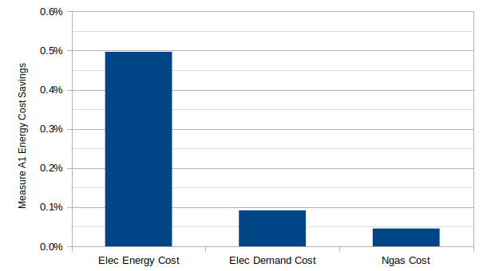

__Figure x. Measure A1 Energy Cost Savings__

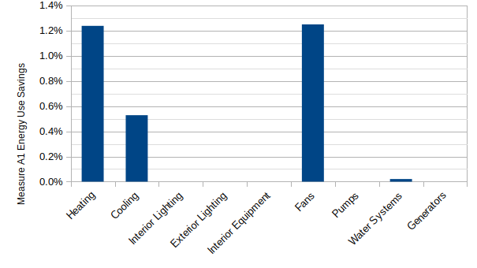

__Figure x. Measure A1 Energy Use Savings__

## 3.2 Dynamic Glazing (A2)

The optimization of this measure focused on two variables for the EnergyPlus 'WindowShadingControl` object. The `Shading Control Type` field, a discrete variable which currently has 21 options for high level control that generally reduce thermal loads, improve visual comfort, or improve daylight; and the `Setpoint` field, a continuous variable that allows additional control based on solar radiation (W/m2), temperature (C), or cooling or heating (W). The shading control options are summarized in Table x below.

__Table x. WindowShadingControl Object Shading Control Types__

Shading Control Type | Cooling | Heating | Cooling and Heating | Other
:- | :- | :- | :- | :-
AlwaysOn | &#9675; | &#9675; | &#9675; | &#9675;
AlwaysOff | &#9675; | &#9675; | &#9675; | &#9675;
OnIfScheduleAllows | &#9673; | &#9675; | &#9675; | &#9675;
OnIfHighSolarOnWindow | &#9673; | &#9675; | &#9675; | &#9675;
OnIfHighHorizontalSolar | &#9673; | &#9675; | &#9675; | &#9675;
OnIfHighOutdoorAirTemperature | &#9673; | &#9675; | &#9675; | &#9675;
OnIfHighZoneAirTemperature | &#9673; | &#9675; | &#9675; | &#9675;
OnIfHighZoneCooling | &#9673; | &#9675; | &#9675; | &#9675;
OnIfHighGlare | &#9675; | &#9675; | &#9675; | &#9673;
MeetDaylightIlluminanceSetpoint | &#9675; | &#9675; | &#9675; | &#9673;
OnNightIfLowOutdoorTempAndOffDay | &#9675; | &#9673; | &#9675; | &#9675;
OnNightIfLowInsideTempAndOffDay | &#9675; | &#9673; | &#9675; | &#9675;
OnNightIfHeatingAndOffDay | &#9675; | &#9673; | &#9675; | &#9675;
OnNightIfLowOutdoorTempAndOnDayIfCooling | &#9675; | &#9675; | &#9673; | &#9675;
OnNightIfHeatingAndOnDayIfCooling | &#9675; | &#9675; | &#9673; | &#9675;
OffNightAndOnDayIfCoolingAndHighSolarOnWindow | &#9673; | &#9675; | &#9675; | &#9675;
OnNightAndOnDayIfCoolingAndHighSolarOnWindow | &#9673; | &#9675; | &#9675; | &#9675;
OnIfHighOutdoorAirTempAndHighSolarOnWindow | &#9673; | &#9675; | &#9675; | &#9675;
OnIfHighOutdoorAirTempAndHighHorizontalSolar | &#9673; | &#9675; | &#9675; | &#9675;
OnIfHighZoneAirTempAndHighSolarOnWindow | &#9673; | &#9675; | &#9675; | &#9675;
OnIfHighZoneAirTempAndHighHorizontalSolar | &#9673; | &#9675; | &#9675; | &#9675;

The pre-optimization process focused on shading control types to reduce heating loads since the model's peak electric demand occurs in the winter months due to air terminals with electric reheat. Furthermore, the selected shading control types were limited to ones that use indoor or outdoor air temperature for setpoint control. Table x. summarizes the pre-optimization variables for this measure.

__Table x. Measure A2 Optimization Variables__

Shading Control Type (discrete) | Setpoints (continuous)
:- | :-
OnNightIfLowInsideTempAndOffDay | 15-21C in 1C increments
OnNightIfLowOutdoorTempAndOffDay | 0-20C in 5C increments
OnNightIfLowOutdoorTempAndOnDayIfCooling | 0-20C in 5C increments

The pre-optimization was comprised of two separate runs using the Baseline Perturbation analysis option in PAT to determine the magnitude and direction of utility cost savings; one for `OnNightIfLowOutdoorTempAndOffDay` and `OnNightIfLowOutdoorTempAndOnDayIfCooling` shading controls, which use an outdoor air temperature setpoint; and one for `OnNightIfLowInsideTempAndOffDay`, which uses an indoor air temperature setpoint. Of these 17 simulations, the `OnNightIfLowOutdoorTempAndOnDayIfCooling` shading control was the only one that showed significant energy cost savings compared to the baseline with the other two shading control types showing very small energy cost increases.

The optimization of this measure used the Particle Swarm Optimization (PSO) analysis option in PAT, which is based on hydroPSO (Zambrano-Bigiarini et. al., 2013) with a single independent variable, the outdoor air temperature setpoint, to minimize the annual energy cost. The as shown in Figure x. 


__Figure x. Measure A2 Optimization Results__

The annual energy cost and use savings for the optimized setpoint of 20.64C is shown in Figures x. and x. below, which showed a savings of 10.3% and 6.1% respectively.


__Figure x. Measure A2 Energy Cost Savings__


__Figure x. Measure A2 Energy Use Savings__

## 3.3 Automated Attachments (A3)

The optimization of this technology used the same methodology as measure A2. The pre-optimization showed similar results as A2, with the `OnNightIfLowOutdoorTempAndOnDayIfCooling` shading control showing the greatest annual energy cost savings compared to the baseline. This control option was chosen for optimization using the PSO analysis option in PAT with the setpoint as the continuous variable to optimize for the lowest annual energy cost. Figures x, x, and x compare the pre-optimization results showing that the `OnNightIfLowOutdoorTempAndOnDayIfCooling` control option produced the greatest savings.

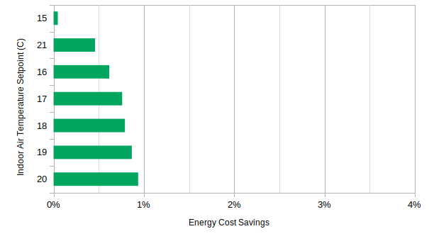

__Figure x. Measure A3 Energy Cost Savings for OnNightIfLowInsideTempAndOffDay Control__

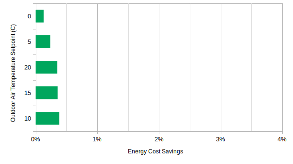

__Figure x. Measure A3 Energy Cost Savings for OnNightIfLowOutdoorTempAndOffDay Control__


__Figure x. Measure A3 Energy Cost Savings for OnNightIfLowOutdoorTempAndOnDayIfCooling Control__

The optimization of this measure used the PSO analysis option in PAT with a single independent variable, the outdoor air temperature setpoint, to minimize the annual energy cost as shown in Figure x. 

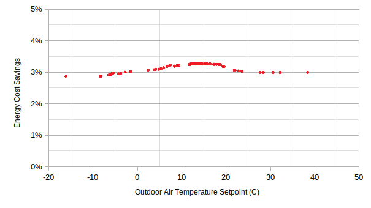

__Figure x. Measure A3 Optimization Results__

The annual energy use and energy cost savings for the optimized setpoint of 13C is shown in Figures x. and x. below, which showed a savings of 1.9% and 3.3% respectively.

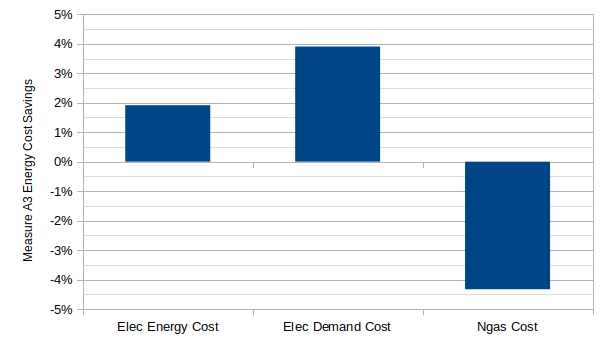

__Figure x. Measure A3 Energy Cost Savings__

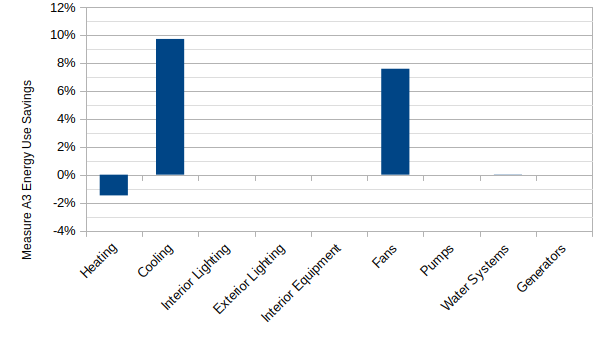

__Figure x. Measure A3 Energy Use Savings__

## 3.4 Continuous-Operation Electronics (E1)

The optimization process for this technology focused on two continuous variables; the `Minimum Limit Duration`, which is the minimum amount of time in minutes that the equipment power is reduced during demand limiting, and the `Maximum Limit Fraction`, which is the fractional limit of full load lighting power reduction where 1.0 indicates no reduction. The optimization first evaluated the effect of the demand limit fraction on the annual energy cost by simulating ten fractions of 0.1 to 1.0 in 0.1 increments. As expected, this variable showed a strong linear relationship with annual energy cost as shown in Figure x below.


__Figure x. Measure E1 Optimization Results for Fraction__

Next, the optimization evaluated the effect of the demand limit duration on the energy cost by simulating durations between 10 minutes and 320 minutes. This variable had a very small effect on the annual energy cost as shown in Figure x. below.


__Figure x. Measure E1 Optimization Results for Duration__

The optimization kept the `Maximum Limit Fraction` fixed at 50% and focused on optimizing the `Minimum Limit Duration`. Because the annual energy cost only varied by about 2.00 USD between the discrete variables in the pre-optimization, this analysis forewent a formal optimization and chose a duration of 40 minutes as the value that minimized the annual energy cost. The energy cost and use savings for a 40 minute demand limit duration was % and % as shown in Figure x. and x. below.

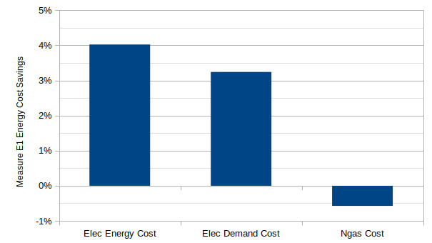

__Figure x. Measure E1 Energy Cost Savings__

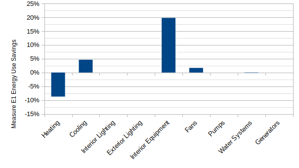

__Figure x. Measure E1 Energy Use Savings__

## 3.5 Separate Sensible and Latent Space Conditioning (M1)

Initial testing of this measure showed small savings compared to the baseline model using default values from the EnergyPlus example file when the  desiccant dehumidifier system was placed downstream of the cooling coil on the supply air stream of all three air loops in the model. This measure was excluded from the optimization because this technology showed savings that were small relative to the baseline. The annual energy cost and use  savings were % and % respectively as shown in Figures x. and x. below. 


__Figure x. Measure M1 Energy Cost Savings__


__Figure x. Measure M1 Energy Use Savings__

## 3.6 Thermal Energy Storage (M2)

The pre-optimization for this measure focused on two discrete variables for the `Coil:Cooling:DX:SingleSpeed:ThermalStorage` object; the `Operating Mode Control Method` and the `Operation Mode Control Schedule Name` fields. The pre-optimization simulated each of the two control methods, EMSControlled and ScheduledModes, with each of the five control schedules to determine the option that minimized the annual energy cost savings compared to the baseline as shown in Figures x. and x. below. For the `Simple User Sched` schedule option, the inputs were kept at default values. Of these eight combinations, the `Simple User Sched` produced the greatest savings with both control methods with the `EMSControlled` method showing greater savings compared to the `Scheduled Modes` option as shown in Figure x. and x. below.


__Figure x. Measure M2 Pre-optimization Results for EMSControlled Control Method__


__Figure x. Measure M2 Pre-optimization Results for ScheduledModes Control Method__

Based on the pre-optimization results, the `EMSControlled` control method was chosen with the `Simple User Sched` schedule option to optimize the annual energy cost. Four of the five continuous variables for the simple user schedule were chosen to optimize with the season fixed at the default value of 01/01-12/31. The four continuous variables of charge start and end time, and discharge start and end time were optimized with discrete hourly values from 0000 to 2400.

The annual energy use intensity and energy cost savings for this measure is shown in Figures x. and x. below.

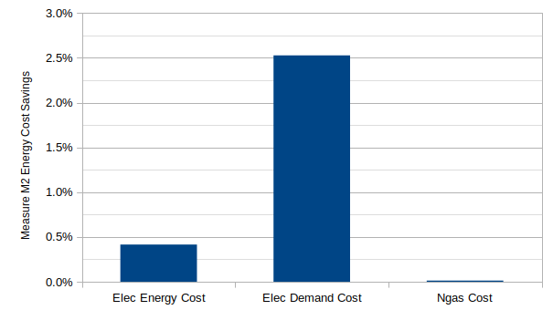

__Figure x. Measure M2 Optimized Energy Cost Savings__


__Figure x. Measure M2 Optimized Energy Use Savings__

## 3.7 Building-Scale CHP (P1)

The pre-optimization of this measure focused on the `Generator Operation Scheme Type` discrete variable. The `DemandLimit` option produced the lowest energy cost compared to the other operation schemes as shown in Figure x.  


__Figure x. Measure P1 Generator Operation Scheme Energy Cost Savings__

The demand limit operation scheme turns on the generator when total demand is above the value set in the `Generator Demand Limit Scheme Purchased Electric Demand Limit` field, which was chosen as the optimization variable. This value was set to 206.1 kW as an initial estimate to maximize demand reduction by reducing peak demand during the month with the lowest utility demand (271.1 kW in September) by the generator's `Maximum Full Load Electrical Power Output` (65 kW), as shown in the object below and Figure x. 

```
ElectricLoadCenter:Distribution,
  Capstone C65 ELCD,                      !- Name
  Capstone C65 ELCD Generators,           !- Generator List Name
  DemandLimit,                            !- Generator Operation Scheme Type
  206100,                                 !- Generator Demand Limit Scheme Purchased Electric Demand Limit {W}
  ,                                       !- Generator Track Schedule Name Scheme Schedule Name
  ,                                       !- Generator Track Meter Scheme Meter Name
  AlternatingCurrent;                     !- Electrical Buss Type
```


__Figure x. Demand Limit Generator Operation Scheme Demand Profile__

The optimization process for this measure used the PSO analysis option in PAT with a single independent continuous variable, the `Generator Demand Limit Scheme Purchased Electric Demand Limit` in Watts, to minimize the annual utility cost. 


__Figure x. Measure P1 Optimization Results__

The annual energy use intensity and energy cost savings for the optimized demand limit of 239.65 kW is shown in Figures x. and x. below, which showed a savings of -6.9% and 9.2% respectively. This measure saved demand costs at the expense of increased natural gas cost and consumption, which shows up under the Generators end use in EnergyPlus.

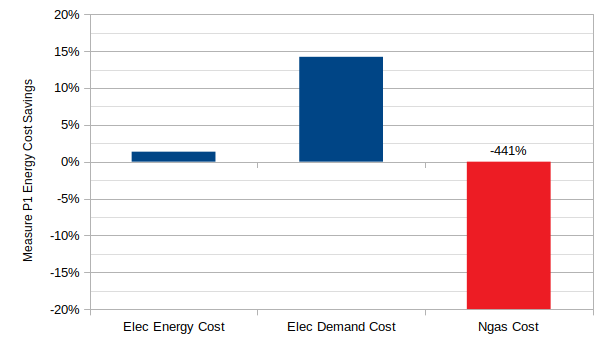

__Figure x. Measure P1 Energy Cost Results__

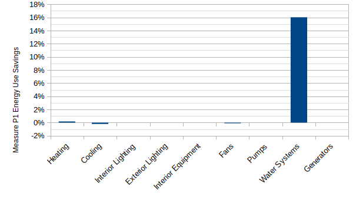

__Figure x. Measure P1 Energy Use Results__

## 3.8 Advanced Sensors and Controls (lighting) (C1)

The pre-optimization process for this technology focused on two continuous variables; the `Minimum Limit Duration`, which is the minimum amount of time in minutes that the lighting power is reduced during demand limiting, and the `Maximum Limit Fraction`, which is the fractional limit of full load lighting power reduction where 1.0 indicates no reduction. The `Maximum Limit Fraction` was fixed at 0.85 based on California's 2016 energy standard, which requires that all buildings greater than 929 m2 (10,000 ft2) be capable of automatically reducing total lighting power by at least 15% in response to a signal from the grid. 

For the optimization, the demand limit duration was simulated at fixed durations to determine the sensitivity of the results. The results showed very small changes in annual energy of about 1.00 USD with durations of 10 minutes to 320 minutes as shown in Figure x.

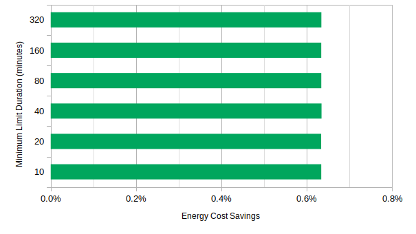

__Figure x. Measure C1 Optimization Results__

The annual energy use intensity and energy cost savings for the optimized duration of 40 minutes is shown in Figures x. and x. below, which showed a savings of % and % respectively.

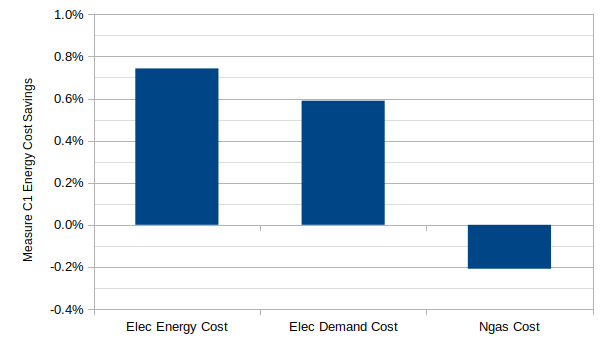

__Figure x. Measure C1 Annual Energy Cost Savings__


__Figure x. Measure C1 Annual Energy Use Intensity Savings by End Use__

## 3.9 Smart Thermostats (C2)

The optimization process for this measure used the Baseline Perturbation analysis option in PAT, which allows discrete values of independent variables to be explored parametrically. For this analysis, the `Maximum Heating Setpoint Reset` and the `Maximum Cooling Setpoint Reset` were optimized to reduce the total annual utility cost by changing the reset temperature by 0.5C increments between the occupied and unoccupied setpoints as summarized in the table x. and x. below. These two independent variables were optimized separately because there is limited interaction between the heating setpoint and cooling setpoint, which also reduced computation time significantly.

__Table x. Maximum Heating Setpoint Reset Temperatures__

Heating Setpoint | Setpoint (C)
:- | :-
Occupied | 21
Discrete Values | 20.5
. | 20
. | 19.5
. | 19
. | 18.5
. | 18
. | 17.5
. | 17
. | 16.5
. | 16
Unoccupied | 15.6

__Table x. Maximum Cooling Setpoint Reset Temperatures__

Cooling Setpoint | Setpoint (C)
:- | :-
Occupied | 24
Discrete Values | 24.5
. | 25
. | 25.5
. | 26
. | 26.5
Unoccupied | 26.7

As expected, greater reset temperatures produced more utility cost savings such that the highest savings occurred with resets that were at or near the unoccupied setpoint temperatures. For heating, the highest cost savings occurred with a reset temperature of 16C, close to the unoccupied setpoint of 15.7C as shown in Figure x. For Cooling, the hightest cost savings occurred with a reset temperature of 26.7C, the unoccupied setpoint as shown in Figure x. The annual energy cost and use savings for the combination of these reset temperatures is shown in Figures x. and x. below, which was 25.0% and 11.5% respectively.

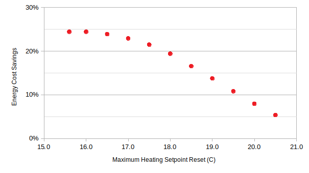

__Figure x. Measure C2 Optimization of Heating Setpoint__


__Figure x. Measure C2 Optimization of Cooling Setpoint__

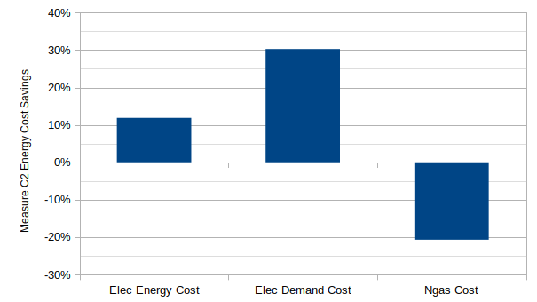

__Figure x. Measure C2 Annual Energy Cost Savings__

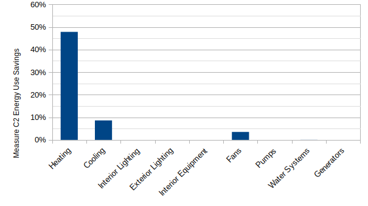

__Figure x. Measure C2 Annual Energy Use Intensity Savings by End Use__

# 5. Conclusions

This report built upon the work of the author that identified ten mature market-ready technologies suitable for GEBs that could also be evaluated with BPS software by quantifying the potential of nine technologies to provide grid services such as energy efficiency, load shedding, and load shifting. The methodology leveraged OpenStudio software tools to develop computer scripts known as Measures for each technology that could be widely applied to OpenStudio models. The analysis used the Medium Office Commercial Reference Building Model as a baseline for evaluating the potential of each technology for providing grid services by optimizing each Measure in OpenStudio's Parametric Analysis Tool to minimize the annual energy cost. Energy cost was chosen as a reasonable metric for determining the grid-interactive benefits of a technology because it includes the effects of both energy efficiency and demand when the utility tariffs include separate charges for consumption and demand. This approach assumes that the utility structures their rate tariffs to reduce the burden on their infrastructure and avoids the need for computationally intensive post processing of hourly or sub-hourly simulation results to determine changes in energy demand. The analysis focused on intra-optimization of each technology by identifying a single independent variable to optimize (where possible), instead of a large scale inter-optimization across all technologies, which significantly reduced the optimization problem and computation requirements. 

Future work should focus on developing a suite of generic Measures that can be applied to building models, developing a workflow for inter-optimization of multiple technologies, and enhancing BPS software such as EnergyPlus to include GEB technologies and reporting capabilities. In particular, improved reporting that easily and readily presents both the time and value of peak demand for both the building and the utility would allow users to evaluate the potential of technologies to provide grid services such as load shedding and load shifting in more detail.